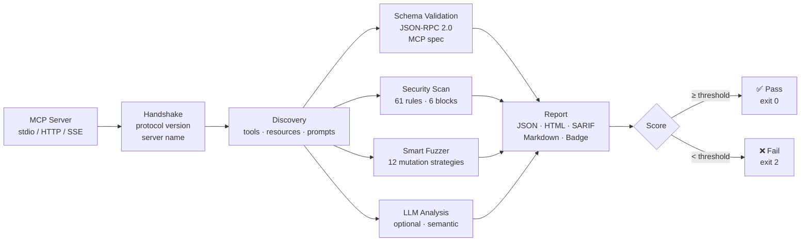
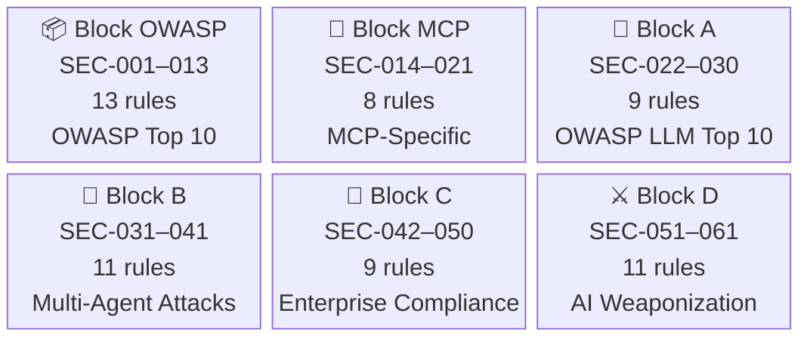
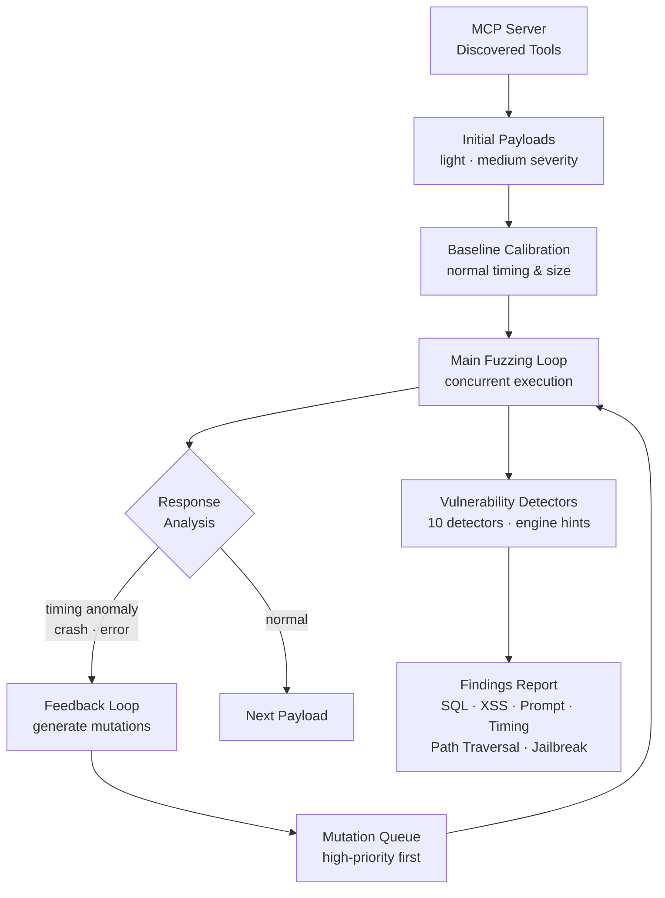
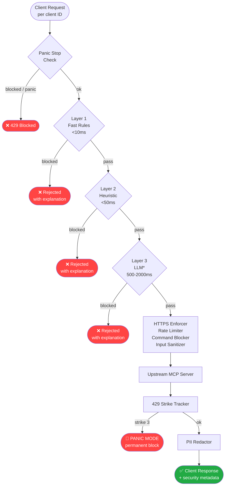

<p align="center">
  
  <br>
  <i>Meet <b>Yogui</b>, the official guardian and mascot of MCP Verify.</i>
</p>

<p align="center">
  <a href="https://github.com/FinkTech/mcp-verify/releases/latest"></a>
  <a href="https://www.gnu.org/licenses/agpl-3.0"></a>
  <a href="https://www.typescriptlang.org/"></a>
  <a href="https://nodejs.org/"></a>
  <a href="./TESTING.md"></a>
  <a href="https://github.com/FinkTech"></a>
</p>

<p align="center">
  
</p>

> **⚠️ Disclaimer:** This project is an independent open-source tool developed by **Ariel A. Fink**. It is **NOT** affiliated with, endorsed by, or connected to Anthropic, the Model Context Protocol organization, or any other entity.

> **⚖️ Responsible Usage:** MCP Verify is designed for **defensive security auditing**. Only scan systems you own or have explicit authorization to test. See [RESPONSIBLE_USAGE.md](RESPONSIBLE_USAGE.md) for ethical guidelines.

> **🚀 v1.0.0:** Core static analysis (61 security rules), Smart Fuzzer, CLI, MCP Server integration, and reporting are stable and production-ready. The automated test suite covers all critical OWASP rules (SEC-001–013) with ongoing improvements to broader rule coverage. We welcome feedback and contributions — see [Known Limitations](#️-known-limitations) for full transparency.

---

## 📄 TL;DR

**Enterprise-grade security toolkit for MCP servers** with 4 interfaces: Interactive Shell, CLI commands, MCP Server tool, and VSCode extension. Features **Smart Fuzzer v1.0** (feedback loop + 12 mutation strategies), **61 security rules** across 6 threat categories (OWASP Top 10, MCP-specific, OWASP LLM Top 10, Multi-Agent Attacks, Enterprise Compliance, AI Weaponization), multi-context workspaces (dev/staging/prod), security profiles (light/balanced/aggressive), and LLM semantic analysis (Gemini FREE tier). Outputs JSON/HTML/SARIF reports with scores (0-100). Production-ready for CI/CD with baseline comparison.

---

## 🎯 Who is this for?

- **MCP Server Developers** - Catch security issues before they reach production
- **DevSecOps Engineers** - Automated security validation in CI/CD pipelines
- **Enterprises Adopting MCP** - Ensure third-party MCP servers meet security standards

---

## ⚡ Quick Start (3 minutes)

```bash
# Clone and build
git clone https://github.com/FinkTech/mcp-verify.git
cd mcp-verify
npm install
npm run build

# Option 1: Interactive Shell (recommended for exploration)
mcp-verify
> set target "node server.js"
> validate
> fuzz --tool "Echo Tool"
> exit

# Option 2: One-shot command (for scripts/CI-CD)
mcp-verify validate "node server.js"
```

**Output:**

```
✓ Validation complete

Validation Report:
──────────────────────────────────────────────────
Server: my-mcp-server
Status: ✓ Valid
Tools: 5 (5 valid)
Technical Vulnerability Score: 95/100 (EXCELLENT)
Quality Score: 92/100

──────────────────────────────────────────────────
JSON: ./reports/json/mcp-report-2026-02-03.json
HTML: ./reports/html/mcp-report-2026-02-03.html
```



📚 **More Examples**: [guides/EXAMPLES.md](./guides/EXAMPLES.md)
🎮 **Interactive Shell**: [See below](#-interactive-shell)
🔧 **Setup LLM Analysis**: [guides/LLM_SETUP.md](./guides/LLM_SETUP.md)
🔄 **CI/CD Integration**: [guides/CI_CD.md](./guides/CI_CD.md)

---

## 🎁 What You Get

### 🔍 Security Analysis

| Feature                              | Description                                                                                                                   |
| ------------------------------------ | ----------------------------------------------------------------------------------------------------------------------------- |
| **💯 Technical Vulnerability Score** | Enterprise-grade scoring engine (0-100) combining 61 security rules, Smart Fuzzer v1.0, and LLM analysis                      |
| **🛡️ 61 Security Rules**             | OWASP Top 10 (13 rules) + MCP-specific (8) + OWASP LLM Top 10 (9) + Multi-agent (11) + Compliance (9) + AI weaponization (11) |
| **🧬 Smart Fuzzer v1.0**             | Intelligent payload generation with feedback loop, 12 mutation strategies, fingerprinting, timing detection                   |
| **📜 Protocol Compliance**           | JSON-RPC 2.0 and MCP 2024-11-05 specification validation                                                                      |
| **👤 Security Profiles**             | `light` (fast CI/CD), `balanced` (default), `aggressive` (deep audits) + custom profiles                                      |

### 🛠️ Tools & Interfaces

| Feature                  | Description                                                                                                                               |
| ------------------------ | ----------------------------------------------------------------------------------------------------------------------------------------- |
| **🎮 Interactive Shell** | Full REPL with autocomplete, history, multi-context workspaces, output redirection                                                        |
| **💻 CLI Commands**      | 11 security tools (validate, fuzz, stress, doctor, proxy, play, dashboard, mock, init, examples, fingerprint)                             |
| **🤖 MCP Server**        | 7 MCP tools for AI agents (validateServer, scanSecurity, analyzeQuality, generateReport, listInstalledServers, selfAudit, compareServers) |
| **📦 VSCode Extension**  | Real-time scanning, 4 tree views, diagnostics, code actions, report panel                                                                 |
| **📊 Web Dashboard**     | Real-time monitoring with live updates ([see docs](./apps/web-dashboard/README.md))                                                       |

### 📊 Analysis & Reporting

| Feature                        | Description                                                                               |
| ------------------------------ | ----------------------------------------------------------------------------------------- |
| **🧠 LLM Semantic Analysis**   | Optional AI-powered deep checks (Gemini FREE tier, Anthropic, Ollama, OpenAI)             |
| **📄 Multiple Report Formats** | JSON (CI/CD), HTML (human), SARIF (GitHub), Markdown, SVG badges                          |
| **📈 Baseline Comparison**     | [Regression detection](./REGRESSION-DETECTION.md) with customizable score drop thresholds |
| **🌍 Multi-Language**          | English + Spanish (i18n system)                                                           |
| **🚀 CI/CD Ready**             | Exit codes (`0`=pass, `1`=warnings, `2`=critical) + GitHub Actions integration            |

---

## 📦 Installation

### Method 1: From Source (Recommended) ✅

```bash
git clone https://github.com/FinkTech/mcp-verify.git
cd mcp-verify
npm install
npm run build

# Use directly
node dist/mcp-verify.js validate "node server.js"

# Or create alias (Linux/macOS)
alias mcp-verify="node $(pwd)/dist/mcp-verify.js"
```

### Method 2: NPM Package ✅

```bash
npm install -g mcp-verify
mcp-verify validate "node server.js"
```

### Method 3: Standalone Binary ✅

```bash
# High-performance native binary using Node SEA
npm run compile        # Current platform only
npm run compile:all    # All platforms (Linux, macOS, Windows)

# Use the binary directly
./dist/bin/linux/mcp-verify validate "node server.js"      # Linux
./dist/bin/macos/mcp-verify validate "node server.js"      # macOS
./dist/bin/windows/mcp-verify.exe validate "node server.js" # Windows
```

---

## 🎮 Interactive Shell

mcp-verify includes a **full-featured interactive shell** for exploratory testing and workflow automation:

```bash
# Start interactive mode (default if no command specified)
mcp-verify

# Or explicitly
mcp-verify interactive
```

### Features

| Feature                      | Description                                                           |
| ---------------------------- | --------------------------------------------------------------------- |
| **Contextual Autocomplete**  | Tab completion for commands, flags, file paths, and tool names        |
| **Persistent History**       | Command history saved to `~/.mcp-verify/history.json` (cross-session) |
| **Multi-Context Workspaces** | Manage dev/staging/prod contexts independently                        |
| **Output Redirection**       | Save command output: `validate > report.txt` or `fuzz >> results.log` |
| **Secret Redaction**         | Automatically redacts API keys from history                           |
| **Session Persistence**      | State saved to `.mcp-verify/session.json` (per-project)               |

### Interactive Commands

```bash
# Session management
set target "node server.js"          # Set default target
set lang es                           # Change language to Spanish
status                                # Show session status
history                               # Show command history
history --clear                       # Clear all history

# Multi-context commands
context list                          # List all contexts
context switch staging                # Switch to staging context
context create testing                # Create new context

# Security profiles
profile set aggressive                # Switch to aggressive profile
profile save my-audit                 # Save current config as custom profile
profile list                          # List available profiles

# Security tools (all CLI commands work in shell)
validate                              # Validate current target
fuzz --tool "Echo Tool"               # Fuzz specific tool
doctor                                # Run diagnostics
stress --users 20                     # Load test with 20 concurrent users

# Shell utilities
clear                                 # Clear screen
exit                                  # Exit shell
help                                  # Show all available commands with descriptions
```

### Prompt Indicators

The prompt shows your current context and profile:

```bash
# Default context
mcp-verify (balanced) >

# Named context with target
[my-project] mcp-verify (dev:aggressive) node server.js >
```

📚 **Full Shell Guide**: [apps/cli-verifier/CLAUDE.md](./apps/cli-verifier/CLAUDE.md)

---

## 🎯 Multi-Context Workspaces

Manage multiple server configurations (dev, staging, prod) with independent settings:

### Create Contexts

```bash
# Interactive mode
mcp-verify
> context create dev
> set target "node dev-server.js"
> profile set light

> context create staging
> set target "https://staging.example.com/mcp"
> profile set balanced

> context create prod
> set target "https://prod.example.com/mcp"
> profile set aggressive
```

### Switch Between Contexts

```bash
> context list
Contexts (3):
● dev        node dev-server.js                      light
○ staging    https://staging.example.com/mcp         balanced
○ prod       https://prod.example.com/mcp            aggressive

> context switch prod
✓ Switched to context: prod
  Target:  https://prod.example.com/mcp
  Profile: aggressive
```

### Context Isolation

Each context has:

- **Independent target** (stdio command or HTTP URL)
- **Independent security profile** (light/balanced/aggressive/custom)
- **Independent configuration** (timeouts, LLM settings, etc.)
- **Separate tool discovery** (cached available tools)

**Persistence**: All contexts saved to `.mcp-verify/session.json` (per-project workspace)

---

## 🛡️ Security Profiles

Control fuzzing intensity and validation strictness with built-in or custom profiles:

### Built-in Profiles

| Profile        | Use Case                  | Payloads | Mutations | Score Threshold | Fail On         |
| -------------- | ------------------------- | -------- | --------- | --------------- | --------------- |
| **light**      | Quick checks, CI/CD       | 25       | 0         | 60              | Critical        |
| **balanced**   | Regular testing (default) | 50       | 3         | 70              | Critical        |
| **aggressive** | Pre-production audits     | 100      | 5         | 90              | Critical + High |

### Profile Comparison

```bash
# Light profile (fast, CI-friendly)
validate "node server.js" --profile light
# ~30 seconds, catches obvious issues

# Balanced profile (default, thorough)
validate "node server.js"
# ~2 minutes, good coverage

# Aggressive profile (comprehensive)
validate "node server.js" --profile aggressive
# ~5 minutes, maximum detection
```

### Custom Profiles

Save your current configuration as a reusable profile:

```bash
# Interactive mode
mcp-verify
> profile set balanced              # Start from balanced
> set fuzz.maxPayloadsPerTool 75    # Customize
> set validate.minScore 85
> profile save my-audit             # Save as custom profile

# Use custom profile
> profile set my-audit
> validate
```

**Storage**: Custom profiles saved to `~/.mcp-verify/config.json` (global, cross-project)

📊 **Profile Details**: Each profile controls:

- Payload count per tool
- Mutation strategies (SQL depth, unicode bypass, timing probes, etc.)
- Anomaly detection thresholds
- Score requirements (minimum acceptable score)
- Failure conditions (fail on critical, fail on high)

---

## 🛠️ Core Commands

### Basic Validation

```bash
# Validate MCP server
mcp-verify validate "node server.js"

# With LLM semantic analysis (Ollama - free, local)
mcp-verify validate "node server.js" --llm ollama:llama3.2

# Generate all report formats
mcp-verify validate "node server.js" --html --format sarif
```

### CI/CD Integration

```bash
# Fail build if critical issues found
mcp-verify validate "node server.js" --fail-on-degradation

# Compare against baseline (regression detection)
mcp-verify validate "node server.js" \
  --save-baseline baseline.json           # First run: save baseline

mcp-verify validate "node server.js" \
  --compare-baseline baseline.json \       # Future runs: compare
  --fail-on-degradation                   # Exit code 2 if scores drop
```

### Troubleshooting

```bash
# Diagnose connection issues
mcp-verify doctor "node server.js"

# Run mock server for testing
mcp-verify mock --port 3000
```

### All Available Commands

| Command       | Purpose                                                                    | Documentation                                      |
| ------------- | -------------------------------------------------------------------------- | -------------------------------------------------- |
| `validate`    | Full security validation with 60 security rules across 6 threat categories | [EXAMPLES.md](./guides/EXAMPLES.md)                |
| `fuzz`        | Smart fuzzer with feedback loop & mutations                                | [COMMANDS.md](./COMMANDS.md#fuzz)                  |
| `stress`      | Load/concurrency testing                                                   | [EXAMPLES.md](./guides/EXAMPLES.md)                |
| `doctor`      | Diagnostics, environment checks & binary integrity verification            | [Doctor Section](#-doctor--diagnostics--integrity) |
| `proxy`       | Transparent proxy with 5 security guardrails                               | [Proxy Section](#-security-proxy-with-guardrails)  |
| `play`        | Interactive tool testing playground                                        | Built-in help                                      |
| `dashboard`   | Real-time terminal monitoring (blessed UI)                                 | Built-in help                                      |
| `mock`        | Mock MCP server for testing clients                                        | Built-in help                                      |
| `init`        | Scaffold new MCP server project                                            | Built-in help                                      |
| `examples`    | Interactive examples browser                                               | Built-in help                                      |
| `fingerprint` | Server technology detection                                                | Built-in help                                      |
| `interactive` | Start interactive shell (default mode)                                     | [Interactive Shell](#-interactive-shell)           |

<p align="center">
  
</p>

### 🩺 Doctor – Diagnostics & Integrity

The `doctor` command performs comprehensive system diagnostics and binary integrity verification:

```bash
# Full diagnostic report
mcp-verify doctor "node server.js"

# Watch mode (auto-refresh every 5s)
mcp-verify doctor --watch

# Verbose output with detailed steps
mcp-verify doctor --verbose

# Generate reports
mcp-verify doctor --html --output ./reports
```

**Binary Integrity Management** (tracks CLI + Server binaries):

```bash
# Show integrity history (last 20 builds)
mcp-verify doctor --show-history

# Regenerate hashes without full rebuild
mcp-verify doctor --fix-integrity

# Clean old history (keep last 10 builds)
mcp-verify doctor --clean-history 10
```

**What Doctor Checks**:

- ✅ Binary integrity (SHA-256 verification of CLI & Server)
- ✅ Environment (Node.js, Python, Git, Deno runtimes)
- ✅ MCP server connectivity & handshake
- ✅ Sensitive environment variables audit

**Integrity Features**:

- Tracks both CLI and Server binaries separately
- Maintains history of last 20 builds (configurable)
- Git commit traceability for each build
- Atomic file operations (crash-safe)
- Located in `.mcp-verify/integrity-history.json` (survives clean)

---

## 🚦 Exit Codes

<p align="center">
  
</p>

mcp-verify uses standard exit codes for CI/CD integration:

| Code  | Meaning     | Description                                      |
| ----- | ----------- | ------------------------------------------------ |
| **0** | ✅ Success  | Server passed validation                         |
| **1** | ⚠️ Warnings | Non-critical issues found                        |
| **2** | ❌ Critical | Security vulnerabilities or baseline degradation |

**Usage in CI/CD**:

```yaml
# GitHub Actions example
- name: Validate MCP Server
  run: mcp-verify validate "node server.js"
  # Fails workflow if exit code is 2 (critical issues)
```

📚 **Full CI/CD Guide**: [guides/CI_CD.md](./guides/CI_CD.md)

---

## 🔐 Security Rules

mcp-verify checks for **61 security vulnerabilities** across **6 threat categories**:



<details open>
<summary><h3>📦 Block OWASP: OWASP Top 10 Aligned (SEC-001 to SEC-013)</h3></summary>

| Rule    | Severity | Description                         | OWASP Mapping |
| ------- | -------- | ----------------------------------- | ------------- |
| SEC-001 | High     | Authentication Bypass               | A07:2021      |
| SEC-002 | Critical | Command Injection                   | A03:2021      |
| SEC-003 | High     | SQL Injection                       | A03:2021      |
| SEC-004 | High     | Server-Side Request Forgery (SSRF)  | A10:2021      |
| SEC-005 | High     | XML External Entity (XXE) Injection | A05:2021      |
| SEC-006 | High     | Insecure Deserialization            | A08:2021      |
| SEC-007 | High     | Path Traversal                      | A01:2021      |
| SEC-008 | Medium   | Data Leakage                        | A01:2021      |
| SEC-009 | High     | Sensitive Data Exposure             | A02:2021      |
| SEC-010 | Medium   | Missing Rate Limiting               | A04:2021      |
| SEC-011 | Medium   | ReDoS (Regular Expression DoS)      | A04:2021      |
| SEC-012 | High     | Weak Cryptography                   | A02:2021      |
| SEC-013 | High     | Prompt Injection                    | Emerging      |

</details>

<details open>
<summary><h3>🔌 Block MCP: MCP-Specific Security (SEC-014 to SEC-021)</h3></summary>

| Rule    | Severity | Description                | Category     |
| ------- | -------- | -------------------------- | ------------ |
| SEC-014 | High     | Exposed Network Endpoint   | MCP Security |
| SEC-015 | High     | Missing Authentication     | MCP Security |
| SEC-016 | Medium   | Insecure URI Scheme        | MCP Security |
| SEC-017 | Medium   | Excessive Tool Permissions | MCP Security |
| SEC-018 | Medium   | Secrets in Descriptions    | MCP Security |
| SEC-019 | Medium   | Missing Input Constraints  | MCP Security |
| SEC-020 | Medium   | Dangerous Tool Chaining    | MCP Security |
| SEC-021 | High     | Unencrypted Credentials    | MCP Security |

</details>

<details>
<summary><h3>🤖 Block A: OWASP LLM Top 10 in MCP Context (SEC-022 to SEC-030)</h3></summary>

| Rule    | Severity | Description                            | OWASP LLM |
| ------- | -------- | -------------------------------------- | --------- |
| SEC-022 | High     | Excessive Agency                       | LLM01     |
| SEC-023 | High     | Prompt Injection via Tools             | LLM01     |
| SEC-024 | Critical | Prompt Injection via Tool Inputs       | LLM01     |
| SEC-025 | High     | Supply Chain Tool Dependencies         | LLM03     |
| SEC-026 | Medium   | Sensitive Data in Tool Responses       | LLM06     |
| SEC-027 | Medium   | Training Data Poisoning                | LLM03     |
| SEC-028 | Medium   | Model DoS via Tools                    | LLM04     |
| SEC-029 | Medium   | Insecure Plugin Design                 | LLM07     |
| SEC-030 | Medium   | Excessive Data Disclosure              | LLM06     |

</details>

<details>
<summary><h3>🤝 Block B: Multi-Agent & Agentic Attacks (SEC-031 to SEC-041)</h3></summary>

| Rule    | Severity | Description                      | Category    |
| ------- | -------- | -------------------------------- | ----------- |
| SEC-031 | High     | Tool Result Tampering            | Multi-Agent |
| SEC-032 | High     | Recursive Agent Loop             | Multi-Agent |
| SEC-033 | High     | Multi-Agent Privilege Escalation | Multi-Agent |
| SEC-034 | Medium   | Agent State Poisoning            | Multi-Agent |
| SEC-035 | Medium   | Distributed Agent DDoS           | Multi-Agent |
| SEC-036 | High     | Agent Swarm Coordination Attack  | Multi-Agent |
| SEC-037 | High     | Agent Identity Spoofing          | Multi-Agent |
| SEC-038 | High     | Cross-Agent Prompt Injection     | Multi-Agent |
| SEC-039 | Medium   | Agent Reputation Hijacking       | Multi-Agent |
| SEC-040 | Medium   | Tool Chaining Path Traversal     | Multi-Agent |
| SEC-041 | Medium   | Agent Memory Injection           | Multi-Agent |

</details>

<details>
<summary><h3>🏢 Block C: Operational & Enterprise Compliance (SEC-042 to SEC-050)</h3></summary>

| Rule    | Severity | Description                    | Category   |
| ------- | -------- | ------------------------------ | ---------- |
| SEC-042 | Medium   | Missing Audit Logging          | Compliance |
| SEC-043 | Medium   | Insecure Session Management    | Compliance |
| SEC-044 | Medium   | Exposed Endpoint               | Compliance |
| SEC-045 | Low      | Insecure Default Configuration | Compliance |
| SEC-046 | Medium   | Missing CORS Validation        | Compliance |
| SEC-047 | Low      | Schema Versioning Absent       | Compliance |
| SEC-048 | Medium   | Missing Capability Negotiation | Compliance |
| SEC-049 | Medium   | Timing Side-Channel in Auth    | Compliance |
| SEC-050 | Low      | Insufficient Output Entropy    | Compliance |

</details>

<details>
<summary><h3>⚔️ Block D: AI Weaponization & Supply Chain (SEC-051 to SEC-061)</h3></summary>

> **⚠️ Note**: Most rules in this block are **disabled by default** due to their adversarial nature. Enable with caution in controlled environments only.

| Rule    | Severity | Description                             | Default     | Category      |
| ------- | -------- | --------------------------------------- | ----------- | ------------- |
| SEC-051 | High     | Weaponized MCP Fuzzer                   | ❌ Disabled | Weaponization |
| SEC-052 | Critical | Autonomous MCP Backdoor                 | ❌ Disabled | Weaponization |
| SEC-053 | Critical | Malicious Config File                   | ❌ Disabled | Supply Chain  |
| SEC-054 | Critical | API Endpoint Hijacking (CVE-2026-21852) | ✅ Enabled  | Supply Chain  |
| SEC-055 | High     | Jailbreak-as-a-Service                  | ❌ Disabled | Weaponization |
| SEC-056 | High     | Phishing via MCP                        | ❌ Disabled | Weaponization |
| SEC-057 | Medium   | Data Exfiltration via Steganography     | ❌ Disabled | Weaponization |
| SEC-058 | Critical | Self-Replicating MCP                    | ❌ Disabled | Weaponization |
| SEC-059 | High     | Unvalidated Tool Authorization          | ✅ Enabled  | Authorization |
| SEC-060 | Medium   | Missing Transaction Semantics           | ✅ Enabled  | Reliability   |
| SEC-061 | High     | Homoglyph / Unicode Spoofing            | ✅ Enabled  | Supply Chain  |

</details>

**Acceptable Risk Levels**:

- **Production**: Score ≥ 90 (Excellent)
- **Staging**: Score ≥ 70 (Good)
- **Internal Tools**: Score ≥ 50 (Fair)

📊 **Detailed Scoring**: [SECURITY_SCORING.md](./SECURITY_SCORING.md)

---

## 🤖 Smart Fuzzer v1.0

The Smart Fuzzer is an **intelligent payload generation engine** that learns from server responses and automatically generates targeted mutations.

### Key Features

| Feature                        | Description                                                                                                      |
| ------------------------------ | ---------------------------------------------------------------------------------------------------------------- |
| **Feedback Loop**              | Analyzes responses for anomalies (timing, crashes, errors) and generates mutations                               |
| **12 Mutation Strategies**     | SQL depth, null-byte injection, unicode bypass, timing probes, buffer stress, quote variation, etc.              |
| **Automatic Fingerprinting**   | Detects server language/framework and disables irrelevant generators (saves 40-60% time)                         |
| **9 Payload Generators**       | Prompt injection, SQL/XSS/CMD injection, JWT attacks, prototype pollution, JSON-RPC violations, schema confusion |
| **10 Vulnerability Detectors** | Timing anomalies, error disclosure, XSS, prompt leaks, jailbreaks, path traversal, weak IDs, info disclosure     |
| **Baseline Calibration**       | Establishes clean timing/size baselines before anomaly detection                                                 |

### How It Works



### Intelligent Mutations

When the fuzzer detects an **interesting response** (timing anomaly, crash, error pattern), it automatically generates targeted variations:

```bash
# Example: SQL injection timing anomaly detected
Original payload: "' OR 1=1 --"
Response time: 2500ms (baseline: 120ms)

Mutations generated:
→ "' OR SLEEP(5) --"           # Timing probe (confirm blind SQLi)
→ "' UNION SELECT * --"        # SQL depth
→ "\" OR 1=1 --"               # Quote variation
→ "\u0027 OR 1=1 --"           # Unicode normalization
```

### Usage Examples

```bash
# Basic fuzzing
mcp-verify fuzz "node server.js"

# Fuzz specific tool
mcp-verify fuzz "node server.js" --tool "DatabaseQuery"

# Aggressive fuzzing with fingerprinting
mcp-verify fuzz "node server.js" \
  --profile aggressive \
  --fingerprint \
  --concurrency 5

# Stop on first crash
mcp-verify fuzz "node server.js" --stop-on-first
```

### Fuzzer Output

```
Smart Fuzzer v1.0
──────────────────────────────────────────────────
Session   : fuzz-1234567890-abc123
Duration  : 45.23s
Payloads  : 250/280
Vulns     : 3 (2 critical, 1 high)
Errors    : 0

── Feedback Loop ──────────────────────────────
Interesting responses : 12
Mutations injected    : 45
Mutation rounds       : 2
Timing anomalies      : 5
Structural drifts     : 4
Server crashes        : 1
```

📚 **Fuzzer Architecture**: [libs/fuzzer/CLAUDE.md](./libs/fuzzer/CLAUDE.md)

---

<p align="center">
  
</p>

### 🛡️ Security Proxy with 3-Layer Gateway + Panic Stop

The proxy command creates a **transparent MCP proxy** with **Security Gateway v1.0**: 3-layer defense system + client-aware panic stop mechanism.

### Security Gateway Architecture (3 Layers)

**Real-time threat detection with progressive analysis:**

| Layer                         | Type               | Latency    | Detection Method            | When Used                                                |
| ----------------------------- | ------------------ | ---------- | --------------------------- | -------------------------------------------------------- |
| **Layer 1: Fast Rules**       | Static patterns    | <10ms      | Regex + hardcoded patterns  | Every request (SQL/CMD injection, path traversal)        |
| **Layer 2: Suspicious Rules** | Heuristic analysis | <50ms      | Scoring + anomaly detection | If Layer 1 passes (tool chaining, excessive permissions) |
| **Layer 3: LLM Rules**        | Deep semantic      | 500-2000ms | AI-powered context analysis | Opt-in only (semantic attacks, novel threats)            |

**Key Features:**

- **Explainable Blocking** - Every rejection includes: rule ID, severity, CWE, OWASP mapping, remediation steps
- **Cache-First Strategy** - SHA-256 hashing with 60s TTL and LRU eviction (1000 entries)
- **Client-Aware State** - Isolated panic tracking per client (prevents DoS from malicious actors)

### 3-Strike Panic Stop System

**Progressive backoff for HTTP 429 (rate limit) errors:**

| Strike       | Backoff    | Trigger                   | Behavior                                                        |
| ------------ | ---------- | ------------------------- | --------------------------------------------------------------- |
| **Strike 1** | 30 seconds | First 429 error           | Client blocked for 30s, auto-resume after                       |
| **Strike 2** | 60 seconds | Second 429 within session | Client blocked for 60s, warning logged                          |
| **Strike 3** | Permanent  | Third 429 within session  | **PANIC MODE** - client permanently blocked until proxy restart |

**Client Identification Priority:**

1. `x-client-id` header (explicit)
2. `x-forwarded-for` header (proxy chain)
3. `remoteAddress` (direct connection)
4. `default-client` (fallback)

### 5 Built-in Guardrails

| Guardrail                     | Protection                                  | Example                                                |
| ----------------------------- | ------------------------------------------- | ------------------------------------------------------ |
| **HTTPS Enforcer**            | Upgrades HTTP → HTTPS for external requests | `http://api.com` → `https://api.com`                   |
| **Input Sanitizer**           | Strips malicious patterns from parameters   | Removes `<script>`, SQL keywords, shell metacharacters |
| **PII Redactor**              | Redacts sensitive data from responses       | Masks SSN, credit cards, API keys in logs              |
| **Rate Limiter**              | Prevents abuse with token bucket algorithm  | Max 100 requests/min per tool (configurable)           |
| **Sensitive Command Blocker** | Blocks dangerous MCP methods                | Prevents `system.exec`, `file.delete`, `db.drop`       |

### Usage

```bash
# Start proxy with Security Gateway (all 3 layers enabled)
mcp-verify proxy "node server.js" --port 8080

# Disable Layer 3 (LLM) for production (faster)
mcp-verify proxy "node server.js" --port 8080 --no-llm-layer

# With custom rate limit + verbose logging
mcp-verify proxy "http://localhost:3000" \
  --port 8080 \
  --rate-limit 50 \
  --verbose

# Production setup with panic stop monitoring
mcp-verify proxy "node server.js" \
  --port 8080 \
  --audit-log proxy-audit.jsonl
```

### Proxy Flow with Security Gateway



> \* Layer 3 (LLM) disabled by default — enable with `--enable-llm-layer`

**Use Cases:**

- **Production Security** - 3-layer defense for untrusted MCP servers
- **DoS Prevention** - Client-aware panic stop prevents resource exhaustion
- **Compliance Auditing** - Full audit trail with explainable blocking
- **Threat Intelligence** - Monitor attack patterns across clients
- **Development Safety** - Prevent accidental PII leakage with redaction

---

## 🔧 MCP Server Tool (for AI Agents)

mcp-verify includes a **full MCP server implementation** that exposes validation capabilities to AI agents like Claude:

### 7 Available Tools

| Tool                   | Purpose                    | Input                      | Output                          |
| ---------------------- | -------------------------- | -------------------------- | ------------------------------- |
| `validateServer`       | Full security validation   | `{ serverPath: string }`   | Validation report with scores   |
| `scanSecurity`         | Security-only scan         | `{ serverPath: string }`   | Security findings array         |
| `analyzeQuality`       | LLM semantic analysis      | `{ serverPath, provider }` | Quality report                  |
| `generateReport`       | Custom report generation   | `{ format, data }`         | Formatted report (JSON/HTML/MD) |
| `listInstalledServers` | Enumerate MCP servers      | `{ configPath? }`          | List of servers from config     |
| `selfAudit`            | Validate mcp-verify itself | `{}`                       | Self-validation report          |
| `compareServers`       | Baseline comparison        | `{ current, baseline }`    | Diff report                     |

### Setup (Claude Desktop)

Add to `~/Library/Application Support/Claude/claude_desktop_config.json` (macOS):

```json
{
  "mcpServers": {
    "mcp-verify": {
      "command": "npx",
      "args": ["-y", "-p", "@finktech/mcp-verify", "mcp-verify-server"],
      "env": {
        "ANTHROPIC_API_KEY": "sk-ant-..."
      }
    }
  }
}
```

### Usage in Claude

```
User: "Validate the MCP server at ./my-server/index.js"

Claude: [Uses validateServer tool]
✓ Validation complete
Security Score: 95/100 (EXCELLENT)
Found 0 critical issues, 1 medium warning

The server looks secure. The medium warning is about missing
rate limiting on the expensive_operation tool.
```

📚 **MCP Server Docs**: [apps/mcp-server/CLAUDE.md](./apps/mcp-server/CLAUDE.md)

---

## 📦 Project Structure (Monorepo)

mcp-verify is organized as a **pnpm workspace monorepo** with clear separation of concerns:

```
mcp-verify/
├── apps/                          # 3 user-facing applications
│   ├── cli-verifier/              # Interactive CLI + one-shot commands
│   ├── mcp-server/                # MCP server with 7 tools for AI agents
│   ├── vscode-extension/          # VSCode extension (real-time scanning)
│   └── web-dashboard/             # Web-based dashboard (React)
│
├── libs/                          # 5 shared libraries
│   ├── core/                      # Business logic (domain, use-cases, infrastructure)
│   ├── fuzzer/                    # Smart Fuzzer v1.0 engine
│   ├── shared/                    # Common utilities (i18n, logging, validators)
│   ├── protocol/                  # MCP protocol types & constants
│   └── transport/                 # Transport layer (stdio, HTTP, SSE)
│
├── tools/                         # Development utilities
│   ├── mocks/                     # Mock MCP servers for testing
│   └── scripts/                   # Build & deployment scripts
│
├── tests/                         # Integration tests
├── examples/                      # Example servers & usage
├── guides/                        # User guides
└── docs/                          # Technical documentation
```

### Architecture Highlights

- **Clean Architecture**: Domain → Use Cases → Infrastructure
- **Zero Any Standard**: Strict TypeScript, no `any` types
- **Dependency Rules**: `apps/` can import from `libs/`, but not vice versa
- **Independent Versioning**: Each app has its own version
- **Shared Build**: Single `node_modules`, incremental builds

📚 **Architecture Details**: [ARCHITECTURE.md](./ARCHITECTURE.md)
📚 **Library Guide**: [libs/CLAUDE.md](./libs/CLAUDE.md)

---

## 🚫 Suppressing False Positives (`.mcpverifyignore`)

Sometimes security warnings are intentional (e.g., a database admin tool with SQL capabilities). Use `.mcpverifyignore` to suppress specific findings:

**Create `.mcpverifyignore` file:**

```bash
# .mcpverifyignore - Simple .gitignore-style syntax

# Ignore SQL injection globally (intentional database tools)
SEC-001

# Ignore all warnings in test files
*.test.js
**/__tests__/**

# Ignore specific tool
database_admin_tool

# Ignore specific line in specific tool
execute_query:45:SEC-001
```

**Supported formats:**

- `SEC-001` - Ignore rule globally
- `*.test.js` - Ignore pattern (glob)
- `tool_name` - Ignore all findings in tool
- `tool_name:line:SEC-001` - Ignore specific location

**Example use cases:**

- ✅ Legitimate SQL/command execution tools
- ✅ Test fixtures with intentional vulnerabilities
- ✅ Admin tools with elevated permissions
- ✅ Known false positives

**See also**: [.mcpverifyignore.example](./.mcpverifyignore.example)

---

## 🧠 LLM Semantic Analysis (Optional)

Enhance validation with AI-powered semantic checks:

```bash
# Google Gemini (FREE tier! 1500 requests/day, no credit card)
export GOOGLE_API_KEY=AIza...
mcp-verify validate "node server.js" --llm gemini:gemini-2.5-flash

# Ollama (free, local, privacy-first)
mcp-verify validate "node server.js" --llm ollama:llama3.2

# Anthropic Claude (best quality, $0.0003/scan)
export ANTHROPIC_API_KEY=sk-ant-...
mcp-verify validate "node server.js" --llm anthropic:claude-haiku-4-5-20251001

# OpenAI GPT (existing API key, $0.0002/scan)
export OPENAI_API_KEY=sk-...
mcp-verify validate "node server.js" --llm openai:gpt-4o-mini
```

**LLM Analysis Detects**:

- Ambiguous tool descriptions
- Missing parameter documentation
- Inconsistent naming conventions
- Potential misuse scenarios

🎯 **Setup Guide**: [guides/LLM_SETUP.md](./guides/LLM_SETUP.md)

---

## 📊 Report Formats

mcp-verify generates multiple report formats:

| Format       | Purpose                    | Location                                   |
| ------------ | -------------------------- | ------------------------------------------ |
| **JSON**     | CI/CD, programmatic access | `./reports/YYYY-MM-DD/validate/json/`      |
| **HTML**     | Human-readable dashboard   | `./reports/YYYY-MM-DD/validate/html/`      |
| **Markdown** | Documentation, README      | `./reports/YYYY-MM-DD/validate/markdown/`  |
| **SARIF**    | GitHub Code Scanning       | `./reports/YYYY-MM-DD/validate/sarif/`     |

**Example HTML Report**:

- Security score with visual indicators
- Vulnerability list with severity colors
- Quality metrics and recommendations
- Protocol compliance status

---

## 📋 Feature Status

### ✅ Stable (Production-Ready)

- **Static Analysis** - 61 security rules across 6 threat categories (OWASP, MCP, LLM Top 10, Multi-Agent, Compliance, Weaponization)
- **Smart Fuzzer v1.0** - Feedback loop, 12 mutation strategies, fingerprinting
- **Protocol Validation** - JSON-RPC 2.0 + MCP 2024-11-05 compliance
- **Interactive Shell** - Multi-context workspaces, autocomplete, history, profiles
- **CLI Commands** - 11 security tools (validate, fuzz, stress, doctor, proxy, play, dashboard, mock, init, examples, fingerprint)
- **MCP Server** - 7 tools for AI agents (validateServer, scanSecurity, etc.)
- **Report Formats** - JSON, SARIF, HTML, Markdown, SVG badges
- **LLM Analysis** - Gemini (FREE tier), Anthropic, Ollama, OpenAI support
- **Internationalization** - English + Spanish (i18n)
- **Security Profiles** - light, balanced, aggressive + custom profiles

### 🧪 Experimental (Beta)

- **Runtime Proxy** - Transparent proxy with 5 security guardrails
- **Deno Sandbox** - Isolated execution (requires Deno, Node.js/Deno only)
- **VSCode Extension** - Real-time scanning, diagnostics, 4 tree views ([in development](./apps/vscode-extension/README.md))
- **Web Dashboard** - Real-time monitoring ([experimental](./apps/web-dashboard/README.md))

Try experimental features:

```bash
# Proxy with guardrails
mcp-verify proxy "http://localhost:3000"

# Sandbox execution (Node.js/Deno only)
mcp-verify validate "node server.js" --sandbox

# VSCode Extension (install from source)
cd apps/vscode-extension && npm run package
code --install-extension ./mcp-verify-1.0.0.vsix
```

---

## 🔧 Troubleshooting

### Common Issues

**"Connection refused"**

```bash
# Check if server is running
ps aux | grep node

# Test with doctor command
mcp-verify doctor "node server.js"
```

**"ANTHROPIC_API_KEY not found"**

```bash
# Set API key
export ANTHROPIC_API_KEY=sk-ant-...

# Or use free Ollama
ollama pull llama3.2
mcp-verify validate "node server.js" --llm ollama:llama3.2
```

**"Deno not found" (for --sandbox)**

```bash
# Install Deno
curl -fsSL https://deno.land/install.sh | sh

# Or skip sandbox
mcp-verify validate "node server.js"  # Works without Deno
```

📚 **More Solutions**: Run `mcp-verify doctor` for diagnostics

---

## 📚 Documentation

### For Users

| Guide                                                                        | Purpose                                                |
| ---------------------------------------------------------------------------- | ------------------------------------------------------ |
| **[COMMANDS.md](./COMMANDS.md)**                                             | **Full CLI Command Reference** (Flags, Options, Usage) |
| **[Interactive Shell](#-interactive-shell)**                                 | Shell features, autocomplete, history, contexts        |
| **[Multi-Context Workspaces](#-multi-context-workspaces)**                   | Managing dev/staging/prod configurations               |
| **[Security Profiles](#-security-profiles)**                                 | light, balanced, aggressive profiles                   |
| **[Smart Fuzzer](#-smart-fuzzer-v10)**                                       | Feedback loop, mutations, fingerprinting               |
| **[Security Proxy](#-security-proxy-with-guardrails)**                       | 5 runtime guardrails                                   |
| **[MCP Server Tool](#-mcp-server-tool-for-ai-agents)**                       | 7 tools for AI agents like Claude                      |
| **[guides/EXAMPLES.md](./guides/EXAMPLES.md)**                               | Copy-paste commands for all scenarios                  |
| **[guides/PROFESSIONAL_VALIDATION.md](./guides/PROFESSIONAL_VALIDATION.md)** | Real-world validation example (enterprise guide)       |
| **[guides/LLM_SETUP.md](./guides/LLM_SETUP.md)**                             | Configure Gemini, Anthropic, Ollama, OpenAI            |
| **[guides/CI_CD.md](./guides/CI_CD.md)**                                     | GitHub Actions, GitLab CI, CircleCI                    |
| **[SECURITY_SCORING.md](./SECURITY_SCORING.md)**                             | Scoring algorithm & acceptable risk levels             |

### For Contributors

| Guide                                                 | Purpose                                    |
| ----------------------------------------------------- | ------------------------------------------ |
| **[DEVELOPMENT.md](./DEVELOPMENT.md)**                | Local setup, testing, debugging            |
| **[CODE_MAP.md](CODE_MAP.md)**                        | Codebase navigation & "I want to..." guide |
| **[ARCHITECTURE.md](./ARCHITECTURE.md)**              | System design & architecture decisions     |
| **[Project Structure](#-project-structure-monorepo)** | Monorepo organization (apps/ + libs/)      |
| **[CONTRIBUTING.md](./CONTRIBUTING.md)**              | Contribution guidelines                    |

### Module Documentation (for AI Agents & Developers)

| Module                                                                   | Purpose                                      | For        |
| ------------------------------------------------------------------------ | -------------------------------------------- | ---------- |
| **[CLAUDE.md](./CLAUDE.md)**                                             | **Project overview** - Read this first!      | AI Agents  |
| **[apps/CLAUDE.md](apps/CLAUDE.md)**                                     | Apps overview (CLI, MCP Server, VSCode, Web) | AI Agents  |
| **[apps/cli-verifier/CLAUDE.md](./apps/cli-verifier/CLAUDE.md)**         | Interactive shell architecture, commands     | AI Agents  |
| **[apps/mcp-server/CLAUDE.md](./apps/mcp-server/CLAUDE.md)**             | 7 MCP tools, LLM formatting                  | AI Agents  |
| **[apps/vscode-extension/CLAUDE.md](./apps/vscode-extension/CLAUDE.md)** | Extension architecture, providers, views     | AI Agents  |
| **[libs/CLAUDE.md](./libs/CLAUDE.md)**                                   | Libraries overview                           | AI Agents  |
| **[libs/core/CLAUDE.md](./libs/core/CLAUDE.md)**                         | Domain logic, 60 security rules, reporting   | AI Agents  |
| **[libs/fuzzer/CLAUDE.md](./libs/fuzzer/CLAUDE.md)**                     | Smart Fuzzer v1.0 internals                  | AI Agents  |
| **[libs/shared/CLAUDE.md](libs/shared/CLAUDE.md)**                       | i18n, CLI helpers, utilities                 | AI Agents  |
| **[libs/README.md](./libs/README.md)**                                   | Library architecture & dependency rules      | Developers |
| **[tools/README.md](./tools/README.md)**                                 | Mock servers & development scripts           | Developers |
| **[apps/web-dashboard/README.md](./apps/web-dashboard/README.md)**       | Web dashboard setup & usage                  | Developers |

---

## 🔐 Security Considerations

### What mcp-verify Protects Against

✅ **OWASP Top 10 Vulnerabilities**
✅ **JSON-RPC 2.0 and MCP Protocol Violations**
✅ **Runtime Security (via Guardrails)** - PII redaction, input sanitization, rate limiting, HTTPS enforcement

### What mcp-verify Does NOT Protect Against

❌ **Race Conditions** - Requires concurrent execution analysis
❌ **Business Logic Flaws** - Requires domain-specific knowledge
❌ **Authorization Bugs** - No access control testing
❌ **Advanced Cryptographic Issues** - Basic checks only

mcp-verify is a **development tool** that helps catch vulnerabilities early. It is **not** a replacement for:

- Security audits by professionals
- Penetration testing
- Runtime application security (RASP)
- Web Application Firewalls (WAF)

### Security Warnings

⚠️ **Command Execution**: mcp-verify executes MCP servers on your machine. Only validate servers you trust or use `--sandbox` flag.

⚠️ **Network Connections**: HTTP transport connects to remote servers. Use HTTPS and validate SSL certificates for production.

⚠️ **Report Files**: Reports may contain sensitive information (API endpoints, data structures). Store securely and don't commit to public repositories.

### Reporting Security Issues

Found a security vulnerability in mcp-verify itself? **Do not** open a public issue.

📧 Email: hello.finksystems@gmail.com
🔒 We'll respond within 48 hours
💰 Responsible disclosure may qualify for acknowledgment

---

## ⚠️ Usage Warnings

Before using mcp-verify in production workflows, understand these critical limitations:

### 🚫 Not a Replacement for Manual Security Testing

**mcp-verify is NOT a substitute for professional penetration testing.**

While mcp-verify automates detection of common technical vulnerabilities (SQL injection, command injection, SSRF), it **cannot replace human expertise** in:

- **Business logic vulnerabilities** - Authorization rules specific to your domain
- **Complex attack chains** - Multi-step exploits requiring context
- **Social engineering vectors** - Phishing, credential stuffing
- **Infrastructure security** - Network misconfigurations, weak TLS settings
- **Supply chain attacks** - Compromised dependencies

**What mcp-verify IS**: A **first-line defense** that catches 80% of technical vulnerabilities automatically, allowing security teams to focus manual effort on complex scenarios.

**What mcp-verify IS NOT**: A security certification or guarantee of safety.

**Recommendation**: Use mcp-verify as part of a **defense-in-depth strategy**:

```
┌─────────────────────────────────────────────────────────┐
│ Layer 1: mcp-verify (Automated Technical Scanning)      │ ← You are here
├─────────────────────────────────────────────────────────┤
│ Layer 2: Manual Code Review (Business Logic)            │
├─────────────────────────────────────────────────────────┤
│ Layer 3: Penetration Testing (Attack Simulation)        │
├─────────────────────────────────────────────────────────┤
│ Layer 4: Runtime Protection (WAF, RASP)                 │
└─────────────────────────────────────────────────────────┘
```

### 🎓 Requires Security Knowledge to Interpret Results

**You need cybersecurity expertise to distinguish real vulnerabilities from false positives.**

mcp-verify generates findings with severity labels (CRITICAL, HIGH, MEDIUM, LOW), but **not all CRITICAL findings are exploitable vulnerabilities**.

**Example of Misinterpretation**:

```typescript
// mcp-verify finding
🔴 CRITICAL: Enum bypass - privilege escalation attempt
Payload: { role: 'admin' }
Response: { error: 'Unauthorized', code: 403 }

// ❌ Inexperienced user: "We have a critical vulnerability!"
// ✅ Security expert: "Server validated correctly - false positive"
```

**Skills Required**:

- Understanding of OWASP Top 10 vulnerabilities
- Ability to read JSON-RPC responses and identify error handling
- Knowledge of attack vectors (SSRF, XSS, injection techniques)
- Experience triaging security findings

**Recommendation**:

- Have a **security engineer review all CRITICAL findings** before escalating
- Use mcp-verify in **CI/CD to block regressions**, not as final security approval
- **Train your team** on common vulnerability patterns before deploying mcp-verify

**Resources**:

- [OWASP Web Security Testing Guide](https://owasp.org/www-project-web-security-testing-guide/)
- [SECURITY_SCORING.md](./SECURITY_SCORING.md) - Understanding mcp-verify's scoring algorithm

### 🐳 Run in Isolated Environments (Docker Recommended)

**Always execute mcp-verify in isolated environments to contain potential risks.**

Despite built-in safety mechanisms (blacklist filtering, static analysis), mcp-verify executes **untrusted MCP servers** and sends **potentially malicious payloads**. Defense-in-depth requires isolation.

**Risks Without Isolation**:

- Malicious MCP server could access your filesystem
- Compromised server could exfiltrate environment variables (API keys, credentials)
- Fuzzing payloads could trigger unintended actions (if server has bugs)

**Recommended Isolation Strategies**:

**Option 1: Docker (Recommended for CI/CD)**

```bash
# Create isolated container
docker run -it --rm \
  --network none \                    # No network access
  -v $(pwd):/workspace:ro \           # Read-only filesystem
  node:20-alpine sh

# Inside container
cd /workspace
npm install --production
mcp-verify validate "node server.js"
```

**Option 2: Dedicated VM (Recommended for Manual Testing)**

```bash
# Use throwaway cloud VM
# AWS EC2, DigitalOcean Droplet, etc.
# Destroy after testing
```

**Option 3: Deno Sandbox (Built-in, Limited)**

```bash
# mcp-verify includes Deno sandbox (experimental)
mcp-verify validate "node server.js" --sandbox

# Limitations: Node.js/Deno servers only
# Not supported: Python, Go, Ruby servers
```

**Minimum Isolation Requirements**:

- ✅ Dedicated user account (non-root, limited permissions)
- ✅ No sensitive environment variables (`AWS_SECRET_ACCESS_KEY`, etc.)
- ✅ No access to production databases
- ✅ Separate network segment (firewall rules)

**CI/CD Example (GitHub Actions)**:

```yaml
# Safe: Runs in ephemeral GitHub-hosted runner
- name: Security Scan
  run: |
    npm install
    mcp-verify validate "node server.js"
  # Container is destroyed after job
```

### 📊 Interpret Scores Correctly

**Security scores are risk indicators, NOT certifications.**

A score of **100/100 does NOT mean "perfectly secure"**. It means **"no known vulnerability patterns detected in static analysis"**.

**What Scores Mean**:

- **95-100**: Low attack surface (static analysis passed)
- **70-94**: Some patterns detected (review findings)
- **40-69**: Multiple issues (remediation needed)
- **0-39**: Critical patterns (do NOT deploy)

**Scores Cannot Detect**:

- Runtime vulnerabilities (race conditions, memory leaks)
- Business logic flaws (authorization bypass)
- Zero-day exploits
- Social engineering

**Example**: A server with score 100 could still be vulnerable to:

```typescript
// Business logic vulnerability (NOT detected by mcp-verify)
if (user.role === "analyst" && action === "deleteAllUsers") {
  // ❌ Analyst shouldn't have this permission
  database.deleteAll("users");
}
```

**Recommendation**: Treat scores as **trend indicators**:

```bash
# Baseline: Score = 95
mcp-verify validate "node server.js" --save-baseline baseline.json

# After code changes: Score = 88
mcp-verify validate "node server.js" --compare-baseline baseline.json
# ⚠️ Score dropped 7 points → Investigate what changed
```

---

## ⚠️ Known Limitations

mcp-verify v1.0.0 has the following known limitations. These are documented transparently to help you make informed decisions:

### 1. Sandbox Support (Node.js/Deno Only)

**Limitation**: The built-in Deno sandbox currently only supports Node.js and Deno servers.

```bash
# ✅ Supported with --sandbox (Full Isolation)
mcp-verify validate "node server.js" --sandbox
mcp-verify validate "deno run server.ts" --sandbox

# ⚠️ Not supported with --sandbox (Manual Verification Required)
mcp-verify validate "python server.py" --no-sandbox
mcp-verify validate "go run server.go" --no-sandbox
```

**Security Warning**: Using `--no-sandbox` grants the server full access to your system. Only use this for servers you have audited manually.

### 2. Log File Persistence

**Limitation**: Logs are written to `stderr` only. No persistent log files in v1.0.

**Impact**: Logs disappear after process exits unless you redirect stderr manually.

**Workaround**:

```bash
# Redirect stderr to file
mcp-verify validate "node server.js" 2> validation.log

# Or use tee for both console and file
mcp-verify validate "node server.js" 2>&1 | tee validation.log
```

**Future**: Rotating log files with configurable retention planned for a future release

### 3. Test Dependencies

**Limitation**: Integration tests for sandbox features require Deno to be installed.

```bash
# Tests will skip sandbox tests if Deno is not installed
npm test
# Output: ⚠️ Deno tests skipped: Deno is not installed
```

**Impact**: Sandbox integration tests are skipped in CI/CD if Deno is unavailable.

**Workaround**: Install Deno for complete test coverage:

```bash
curl -fsSL https://deno.land/install.sh | sh  # Linux/macOS
irm https://deno.land/install.ps1 | iex       # Windows
```

### 4. LLM Semantic Analysis (Optional Feature)

**Limitation**: LLM semantic analysis requires:

- Google API key (FREE tier available!) OR
- API keys (Anthropic or OpenAI) OR
- Local Ollama installation

**Impact**: Without LLM setup, you get static analysis only (still comprehensive with 60 security rules across 6 threat categories).

**Workaround**: Use free Google Gemini:

```bash
# Get free API key from https://aistudio.google.com/apikey
export GOOGLE_API_KEY=AIza...

# Run with LLM analysis (FREE - 1500 requests/day)
mcp-verify validate "node server.js" --llm gemini:gemini-2.5-flash
```

Or use free local Ollama:

```bash
# Install Ollama (https://ollama.ai)
ollama pull llama3.2

# Run with LLM analysis
mcp-verify validate "node server.js" --llm ollama:llama3.2
```

**See**: [guides/LLM_SETUP.md](./guides/LLM_SETUP.md) for detailed setup

### 5. Report Generation

**Limitation**: SARIF reports require explicit `--format sarif` flag.

**Expected Behavior**:

```bash
# Always generated: JSON, HTML, Markdown
mcp-verify validate "node server.js"

# SARIF only generated with flag
mcp-verify validate "node server.js" --format sarif
```

**Rationale**: SARIF is primarily for GitHub Code Scanning integration, not needed for most users.

### Non-Limitations (What Works Well)

✅ **Multi-platform**: Windows, Linux, macOS fully supported
✅ **Protocol Support**: Stdio, HTTP, SSE transports work reliably
✅ **Static Analysis**: 61 security rules across 6 threat categories, 100+ test cases, production-ready
✅ **CI/CD Integration**: Exit codes, baseline comparison, regression detection
✅ **Report Formats**: JSON, HTML, Markdown always generated
✅ **Internationalization**: English and Spanish fully supported

### Reporting Issues

If you encounter issues not documented here:

📧 Email: hello.finksystems@gmail.com
🐛 GitHub Issues: [FinkTech/mcp-verify/issues](https://github.com/FinkTech/mcp-verify/issues)
💬 Discussions: [FinkTech/mcp-verify/discussions](https://github.com/FinkTech/mcp-verify/discussions)

---

## 🤝 Contributing

We welcome contributions! Whether you're:

- 🐛 Reporting bugs
- 💡 Suggesting features
- 📝 Improving documentation
- 🔧 Submitting pull requests

### Quick Start for Contributors

Follow [Installation → Method 1](#method-1-from-source-recommended-) to build from source, then:

```bash
# Run tests
npm test

# Test locally against a mock server
node dist/mcp-verify.js validate "node tools/mocks/servers/simple-server.js"
```

### Before Submitting PR

1. ✅ Tests pass (`npm test`)
2. ✅ Linting passes (`npm run lint`)
3. ✅ Code follows style guide
4. ✅ Documentation updated
5. ✅ Commit messages are clear

📖 **Full Guide**: [CONTRIBUTING.md](./CONTRIBUTING.md)
🌲 **Branching Strategy**: [docs/BRANCHING.md](./docs/BRANCHING.md)
🗺️ **Codebase Navigation**: [CODE_MAP.md](CODE_MAP.md)
🏗️ **Architecture**: [ARCHITECTURE.md](./ARCHITECTURE.md)

### 🤖 Future: AI-Powered Code Review

As MCP Verify grows, we're exploring AI-powered code review automation. The vision: specialized review agents for architecture validation, license compliance scanning, and security rule correctness verification. **Current state:** all code review is done manually by maintainers. We run periodic quality audits using internal tooling, with room to scale intelligently as the project grows.

---

## 📹 Visual Demos

> **Note:** Animated GIF demonstrations of MCP Verify features are currently being produced and will be available soon in the documentation. These demos will showcase the Interactive Shell, security scanning workflows, and HTML report visualization.
>
> VHS tape files (`.tape`) for demo recording are excluded from the repository to keep it lightweight, but the generated GIFs will be included in the documentation once finalized.

Stay tuned for visual walkthroughs!

---

## 📄 License

**MCP Verify** is licensed under **GNU Affero General Public License v3.0 (AGPL-3.0)** - see [LICENSE](./LICENSE) file for full terms.

### What This Means for You

#### ✅ Free Usage Scenarios

You can use MCP Verify **completely free** if:

- **Internal/Private Use** - Deploy within your organization without exposing to external users
- **Self-Hosting** - Run on your own infrastructure for your team or personal projects
- **Open Source Contributions** - Fork, modify, and distribute under AGPL-3.0 terms

#### ⚠️ SaaS/Commercial Hosting

If you want to **offer MCP Verify as a hosted service** (SaaS) to third parties, you have two options:

1. **Open Source Your Service** - Publish your complete source code (including modifications) under AGPL-3.0
2. **Commercial License** - Contact us for a proprietary license that allows closed-source SaaS

**Why AGPL?** We chose AGPL to prevent competitors from taking the open-source code, wrapping it as a proprietary SaaS, and not contributing improvements back to the community. This ensures sustainability and fairness.

### Dual Licensing Model

Similar to **Grafana**, **MongoDB**, and other successful open-source projects:

- **Core Open Source** (AGPL-3.0) - Free forever for internal use and self-hosting
- **Commercial License** (Paid) - For SaaS providers who prefer proprietary deployments

**Need a commercial license?** Contact us at **hello.finksystems@gmail.com**

### For Contributors

All contributions are licensed under AGPL-3.0:

- **DCO Required** - All commits must be signed-off ([Developer Certificate of Origin](DCO.txt))
- **Contributor License Agreement (CLA)** - May be required for larger contributions

```bash
# Sign-off your commits
git commit -s -m "feat: add new feature"

# Configure git to always sign-off
git config --global format.signoff true
```

**Why DCO?** It's a lightweight way (used by Linux, Docker, Kubernetes) to certify you have the right to submit your code, without heavy legal paperwork.

📚 **Full Guide**: [CONTRIBUTING.md](./CONTRIBUTING.md)

---

## ⭐ Show Your Support

If mcp-verify helps secure your MCP servers, please:

- ⭐ Star this repository
- 🐦 Share on social media
- 📝 Write a blog post about your experience
- 🤝 Contribute improvements

---

📧 Email: hello.finksystems@gmail.com
💼 LinkedIn: [Ariel Fink](https://linkedin.com/in/ariel-fink)
🐙 GitHub: [@FinkTech](https://github.com/FinkTech)

---

**Questions?** Open an issue or start a discussion on GitHub.
**Need Help?** Run `mcp-verify doctor` or check [guides/](./guides/)
**Troubleshooting**: [TROUBLESHOOTING.md](./TROUBLESHOOTING.md)
