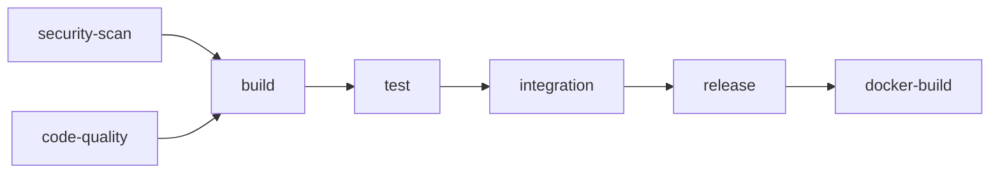

# 🔄 CI/CD Integration Guide

**Last Updated**: 2026-02-24
**Target Audience**: DevOps Engineers, CI/CD Users (Persona 2)
**Time to Setup**: 5-10 minutes

---

## 📋 Table of Contents

- [MCP Verify's Own CI/CD Pipeline](#mcp-verifys-own-cicd-pipeline)
- [Integrating MCP Verify Into Your Pipeline](#integrating-mcp-verify-into-your-pipeline)

---

## MCP Verify's Own CI/CD Pipeline

This section documents the CI/CD pipeline for mcp-verify itself. If you're looking to integrate mcp-verify into your own project, skip to [Integrating MCP Verify Into Your Pipeline](#integrating-mcp-verify-into-your-pipeline).

### 🚀 Pipeline Overview

MCP Verify uses an enterprise-grade GitHub Actions pipeline with the following features:

- **Security Scanning**: Trivy, CodeQL, npm audit
- **Code Quality**: ESLint, Prettier, TypeScript strict mode
- **Multi-OS Testing**: Ubuntu, macOS, Windows
- **Multi-Node Testing**: Node 18, 20, 22
- **Automated Releases**: NPM publishing with provenance
- **GitHub Releases**: Automatic release creation
- **SBOM Generation**: Software Bill of Materials
- **Docker Images**: GitHub Container Registry
- **Code Coverage**: Codecov integration

### 📝 Required Secrets

To enable full pipeline functionality, configure these GitHub Secrets:

| Secret Name | Required | Purpose |
|-------------|----------|---------|
| `NPM_TOKEN` | Yes (for releases) | Publish to NPM registry |
| `CODECOV_TOKEN` | Optional | Upload coverage reports |
| `GITHUB_TOKEN` | Auto-provided | GitHub API access |

#### Setting up NPM_TOKEN

```bash
# Login to NPM
npm login

# Create automation token (required for CI/CD)
npm token create --type=automation

# Copy the token (starts with npm_...)
# Add to GitHub: Settings → Secrets and variables → Actions → NPM_TOKEN
```

### 🔄 Release Process

The pipeline automatically releases when you push a version tag:

```bash
# Update version and create tag
npm version patch  # or minor, major
# This creates commit and tag like v1.0.1

# Push to GitHub
git push origin main --tags

# GitHub Actions will automatically:
# 1. Run all tests and security scans
# 2. Create GitHub Release with changelog
# 3. Publish to NPM with provenance
# 4. Build Docker image
# 5. Generate SBOM
```

### 📊 Pipeline Jobs



**Parallel Phase:**
- `security-scan`: Trivy + npm audit
- `sast`: CodeQL static analysis
- `code-quality`: Linting, formatting, type checking
- `dependency-review`: PR-only dependency checks
- `license-check`: License compliance

**Sequential Phase:**
- `build`: Compile and bundle
- `test`: Multi-OS matrix testing (9 combinations)
- `coverage`: Upload to Codecov
- `integration`: Integration tests
- `performance`: Benchmarking

**Release Phase (tags only):**
- `release`: NPM publish + GitHub Release
- `docker-build`: Container image build

### 🎯 Exit Codes & Behavior

- **Pull Requests**: Run all checks except release
- **Push to main**: Run all checks except release
- **Tag push (v\*)**: Run full pipeline including release
- **Manual**: Can skip tests via workflow dispatch

### 📖 Full Documentation

For complete setup instructions, troubleshooting, and advanced configurations, see:
- Pipeline configuration: `.github/workflows/ci.yml`
- Detailed guide: `COMMANDS.md` (CI/CD section)

---

## Integrating MCP Verify Into Your Pipeline

This section explains how to integrate mcp-verify into your own CI/CD pipeline to automatically validate MCP servers on every commit, PR, or deployment.

**Benefits**:
- ✅ Block PRs with security vulnerabilities (60 security rules)
- ✅ Run servers in isolated Sandbox (Deno/Docker)
- ✅ Track security score trends over time
- ✅ Prevent regressions (baseline comparison)
- ✅ Upload results to GitHub Security tab (SARIF)

---

## ⚡ Quick Start

### Minimum Viable Pipeline

```yaml
# Works with: GitHub Actions, GitLab CI, CircleCI, etc.
- name: Validate MCP Server
  run: |
    git clone https://github.com/FinkTech/mcp-verify.git
    cd mcp-verify
    npm install
    npm run build
    node dist/mcp-verify.js validate \
      --server "node ../your-server.js" \
      --security \
      --format sarif
```

**Exit codes**: `0` = pass, `1` = warnings, `2` = critical issues

---

## 🐙 GitHub Actions

### Basic Validation

```yaml
# .github/workflows/mcp-validation.yml
name: MCP Server Validation

on:
  push:
    branches: [ main, develop ]
  pull_request:
    branches: [ main ]

jobs:
  validate:
    runs-on: ubuntu-latest

    steps:
      - name: Checkout code
        uses: actions/checkout@v3

      - name: Setup Node.js
        uses: actions/setup-node@v3
        with:
          node-version: '18'

      - name: Install dependencies
        run: npm install

      - name: Clone mcp-verify
        run: |
          git clone https://github.com/FinkTech/mcp-verify.git
          cd mcp-verify
          npm install
          npm run build

      - name: Validate Server
        run: |
          cd mcp-verify
          node dist/mcp-verify.js validate \
            --server "node ../src/server.js" \
            --security \
            --format json \
            --format sarif \
            --output ../reports

      - name: Upload Reports
        uses: actions/upload-artifact@v3
        if: always()
        with:
          name: mcp-reports
          path: reports/
```

---

### With GitHub Security Tab (SARIF)

```yaml
# .github/workflows/mcp-security.yml
name: MCP Security Scan

on:
  push:
    branches: [ main ]
  pull_request:
    branches: [ main ]

jobs:
  security-scan:
    runs-on: ubuntu-latest
    permissions:
      security-events: write  # Required for SARIF upload

    steps:
      - uses: actions/checkout@v3

      - name: Setup Node.js
        uses: actions/setup-node@v3
        with:
          node-version: '18'

      - name: Install mcp-verify
        run: |
          git clone https://github.com/FinkTech/mcp-verify.git
          cd mcp-verify
          npm install
          npm run build

      - name: Security Scan
        run: |
          cd mcp-verify
          node dist/mcp-verify.js validate \
            --server "node ../server.js" \
            --security \
            --format sarif \
            --output ../reports

      - name: Upload SARIF to GitHub Security
        uses: github/codeql-action/upload-sarif@v2
        if: always()
        with:
          sarif_file: reports/sarif/mcp-report-*.sarif
          category: mcp-security
```

**View results**: GitHub repo → Security → Code scanning alerts

---

### With LLM Semantic Analysis

```yaml
# .github/workflows/mcp-full-analysis.yml
name: MCP Full Analysis (Security + LLM)

on:
  push:
    branches: [ main ]
  pull_request:
    branches: [ main ]

jobs:
  full-analysis:
    runs-on: ubuntu-latest

    steps:
      - uses: actions/checkout@v3

      - name: Setup Node.js
        uses: actions/setup-node@v3
        with:
          node-version: '18'

      - name: Install mcp-verify
        run: |
          git clone https://github.com/FinkTech/mcp-verify.git
          cd mcp-verify
          npm install
          npm run build

      - name: Full Analysis with LLM
        env:
          ANTHROPIC_API_KEY: ${{ secrets.ANTHROPIC_API_KEY }}
        run: |
          cd mcp-verify
          node dist/mcp-verify.js validate \
            --server "node ../server.js" \
            --security \
            --llm anthropic:claude-haiku-4-5-20251001 \
            --format html \
            --format sarif \
            --output ../reports

---

### With Smart Fuzzing (Active Security Testing)

Run dynamic security tests to detect runtime vulnerabilities like Jailbreaks and Prompt Leaks.

```yaml
# .github/workflows/mcp-fuzzing.yml
  fuzzing-test:
    runs-on: ubuntu-latest
    steps:
      - uses: actions/checkout@v3
      - name: Install mcp-verify
        run: |
          git clone https://github.com/FinkTech/mcp-verify.git
          cd mcp-verify && npm install && npm run build
      
      - name: Run Security Fuzzer
        run: |
          cd mcp-verify
          node dist/mcp-verify.js validate \
            --server "node ../server.js" \
            --fuzz \
            --fuzz-concurrency 5 \
            --fuzz-timeout 5000 \
            --format html
```

      - name: Upload Reports
        uses: actions/upload-artifact@v3
        if: always()
        with:
          name: mcp-full-reports
          path: reports/
```

**Setup**: Add `ANTHROPIC_API_KEY` to GitHub Secrets (Settings → Secrets and variables → Actions)

---

### With Baseline Comparison (Regression Detection)

```yaml
# .github/workflows/mcp-regression.yml
name: MCP Regression Detection

on:
  push:
    branches: [ main ]
  pull_request:
    branches: [ main ]

jobs:
  regression-check:
    runs-on: ubuntu-latest

    steps:
      - uses: actions/checkout@v3

      - name: Setup Node.js
        uses: actions/setup-node@v3
        with:
          node-version: '18'

      - name: Install mcp-verify
        run: |
          git clone https://github.com/FinkTech/mcp-verify.git
          cd mcp-verify
          npm install
          npm run build

      - name: Save Baseline (main branch only)
        if: github.ref == 'refs/heads/main'
        run: |
          cd mcp-verify
          node dist/mcp-verify.js validate \
            --server "node ../server.js" \
            --security \
            --save-baseline ../baseline.json

      - name: Check for Regressions (PRs only)
        if: github.event_name == 'pull_request'
        run: |
          cd mcp-verify
          node dist/mcp-verify.js validate \
            --server "node ../server.js" \
            --security \
            --compare-baseline ../baseline.json \
            --fail-on-degradation \
            --allowed-score-drop 5

      - name: Upload Reports
        uses: actions/upload-artifact@v3
        if: always()
        with:
          name: mcp-regression-reports
          path: reports/
```

**How it works**:
- On `main` branch: Save current state as baseline
- On PRs: Compare against baseline, fail if regression detected

---

### Block PRs with Critical Issues

```yaml
# .github/workflows/mcp-gate.yml
name: MCP Security Gate

on:
  pull_request:
    branches: [ main ]

jobs:
  security-gate:
    runs-on: ubuntu-latest

    steps:
      - uses: actions/checkout@v3

      - name: Setup Node.js
        uses: actions/setup-node@v3
        with:
          node-version: '18'

      - name: Install mcp-verify
        run: |
          git clone https://github.com/FinkTech/mcp-verify.git
          cd mcp-verify
          npm install
          npm run build

      - name: Security Gate (Block on Critical)
        run: |
          cd mcp-verify
          node dist/mcp-verify.js validate \
            --server "node ../server.js" \
            --security \
            --format sarif

          EXIT_CODE=$?
          if [ $EXIT_CODE -eq 2 ]; then
            echo "❌ CRITICAL SECURITY ISSUES DETECTED - Blocking PR"
            exit 2
          fi
```

**Behavior**:
- Exit 0: PR can merge
- Exit 1: Warnings, but PR can merge
- Exit 2: **Critical issues, PR is blocked**

---

## 🦊 GitLab CI

### Basic Validation

```yaml
# .gitlab-ci.yml
stages:
  - test
  - security

mcp_validation:
  stage: test
  image: node:18
  script:
    - git clone https://github.com/FinkTech/mcp-verify.git
    - cd mcp-verify
    - npm install
    - npm run build
    - node dist/mcp-verify.js validate \
        --server "node ../server.js" \
        --security \
        --format json \
        --output ../reports
  artifacts:
    paths:
      - reports/
    expire_in: 30 days
```

---

### With Security Dashboard

```yaml
# .gitlab-ci.yml
stages:
  - security

mcp_security:
  stage: security
  image: node:18
  script:
    - git clone https://github.com/FinkTech/mcp-verify.git
    - cd mcp-verify
    - npm install
    - npm run build
    - node dist/mcp-verify.js validate \
        --server "node ../server.js" \
        --security \
        --format sarif \
        --output ../reports
  artifacts:
    reports:
      sast: reports/sarif/mcp-report-*.sarif
```

**View results**: GitLab → Security & Compliance → Vulnerability Report

---

### With LLM Analysis

```yaml
# .gitlab-ci.yml
mcp_llm_analysis:
  stage: security
  image: node:18
  variables:
    ANTHROPIC_API_KEY: $ANTHROPIC_API_KEY  # Set in GitLab CI/CD Variables
  script:
    - git clone https://github.com/FinkTech/mcp-verify.git
    - cd mcp-verify
    - npm install
    - npm run build
    - node dist/mcp-verify.js validate \
        --server "node ../server.js" \
        --security \
        --llm anthropic:claude-haiku-4-5-20251001 \
        --format html \
        --output ../reports
  artifacts:
    paths:
      - reports/
```

**Setup**: GitLab → Settings → CI/CD → Variables → Add `ANTHROPIC_API_KEY`

---

## ⭕ CircleCI

### Basic Validation

```yaml
# .circleci/config.yml
version: 2.1

jobs:
  validate-mcp:
    docker:
      - image: cimg/node:18.0

    steps:
      - checkout

      - run:
          name: Install mcp-verify
          command: |
            git clone https://github.com/FinkTech/mcp-verify.git
            cd mcp-verify
            npm install
            npm run build

      - run:
          name: Validate Server
          command: |
            cd mcp-verify
            node dist/mcp-verify.js validate \
              --server "node ../server.js" \
              --security \
              --format json \
              --output ../reports

      - store_artifacts:
          path: reports/

workflows:
  version: 2
  build:
    jobs:
      - validate-mcp
```

---

## 🔵 Azure Pipelines

### Basic Validation

```yaml
# azure-pipelines.yml
trigger:
  - main

pool:
  vmImage: 'ubuntu-latest'

steps:
  - task: NodeTool@0
    inputs:
      versionSpec: '18.x'
    displayName: 'Install Node.js'

  - script: |
      git clone https://github.com/FinkTech/mcp-verify.git
      cd mcp-verify
      npm install
      npm run build
    displayName: 'Install mcp-verify'

  - script: |
      cd mcp-verify
      node dist/mcp-verify.js validate \
        --server "node ../server.js" \
        --security \
        --format sarif \
        --output ../reports
    displayName: 'Validate MCP Server'

  - task: PublishBuildArtifacts@1
    inputs:
      pathToPublish: 'reports'
      artifactName: 'mcp-reports'
```

---

## 🪝 Pre-commit Hooks (Local Development)

### Husky Setup

```bash
# Install Husky
npm install --save-dev husky

# Initialize
npx husky install

# Add pre-commit hook
npx husky add .husky/pre-commit "npm run mcp:validate"
```

### Package.json Script

```json
{
  "scripts": {
    "mcp:validate": "mcp-verify validate --server \"node server.js\" --security --quiet"
  }
}
```

**Now**: Every `git commit` runs mcp-verify automatically.

---

## 📊 Exit Code Handling

### Understanding Exit Codes

| Exit Code | Meaning | CI/CD Action |
|-----------|---------|--------------|
| `0` | ✅ Success | Continue pipeline |
| `1` | ⚠️ Warnings | Continue (optional warning) |
| `2` | 🔴 Critical | **Fail pipeline** |

### Example: Conditional Failure

```bash
# Fail only on critical issues (exit 2)
mcp-verify validate --server "node server.js" --security
EXIT_CODE=$?

if [ $EXIT_CODE -eq 2 ]; then
  echo "❌ CRITICAL - Blocking build"
  exit 2
elif [ $EXIT_CODE -eq 1 ]; then
  echo "⚠️ WARNINGS - Allowing build"
  exit 0  # Don't fail CI
else
  echo "✅ SUCCESS"
  exit 0
fi
```

---

## 📈 Baseline Tracking

### Save Baseline on Release

```yaml
# On git tag push
on:
  push:
    tags:
      - 'v*'

jobs:
  save-baseline:
    runs-on: ubuntu-latest
    steps:
      - uses: actions/checkout@v3

      - name: Save Release Baseline
        run: |
          mcp-verify validate \
            --server "node server.js" \
            --security \
            --save-baseline ./baselines/production-${GITHUB_REF_NAME}.json

      - name: Commit Baseline
        run: |
          git add baselines/
          git commit -m "chore: save baseline for ${GITHUB_REF_NAME}"
          git push
```

### Compare in CI

```yaml
# On pull request
jobs:
  check-regression:
    runs-on: ubuntu-latest
    steps:
      - uses: actions/checkout@v3

      - name: Check for Regressions
        run: |
          mcp-verify validate \
            --server "node server.js" \
            --security \
            --compare-baseline ./baselines/production-latest.json \
            --fail-on-degradation \
            --allowed-score-drop 5
```

---

## 🎨 Custom Report Publishing

### Slack Notification

```yaml
- name: Validate Server
  id: validate
  run: |
    mcp-verify validate \
      --server "node server.js" \
      --security \
      --json-stdout > report.json

    SCORE=$(jq '.security.score' report.json)
    echo "score=$SCORE" >> $GITHUB_OUTPUT

- name: Notify Slack
  if: steps.validate.outputs.score < 80
  uses: slackapi/slack-github-action@v1
  with:
    payload: |
      {
        "text": "⚠️ MCP Security Score: ${{ steps.validate.outputs.score }}/100 - Review required!"
      }
  env:
    SLACK_WEBHOOK_URL: ${{ secrets.SLACK_WEBHOOK }}
```

---

### Email Notification

```yaml
- name: Send Email on Failure
  if: failure()
  uses: dawidd6/action-send-mail@v3
  with:
    server_address: smtp.gmail.com
    server_port: 465
    username: ${{ secrets.EMAIL_USERNAME }}
    password: ${{ secrets.EMAIL_PASSWORD }}
    subject: "❌ MCP Validation Failed - ${{ github.repository }}"
    to: security-team@company.com
    from: ci-bot@company.com
    body: |
      MCP validation failed for commit ${{ github.sha }}

      View logs: ${{ github.server_url }}/${{ github.repository }}/actions/runs/${{ github.run_id }}
```

---

## 🚀 Performance Optimization

### Cache Dependencies

```yaml
# GitHub Actions
- name: Cache mcp-verify
  uses: actions/cache@v3
  with:
    path: |
      mcp-verify/node_modules
      mcp-verify/dist
    key: mcp-verify-${{ hashFiles('**/package-lock.json') }}

- name: Install mcp-verify
  run: |
    if [ ! -d "mcp-verify" ]; then
      git clone https://github.com/FinkTech/mcp-verify.git
      cd mcp-verify
      npm install
      npm run build
    fi
```

**Result**: ~60s faster on cache hit

---

### Parallel Jobs

```yaml
# Run security and quality checks in parallel
jobs:
  security:
    runs-on: ubuntu-latest
    steps:
      - name: Security Scan
        run: mcp-verify validate --server "..." --security

  llm-analysis:
    runs-on: ubuntu-latest
    steps:
      - name: LLM Analysis
        env:
          ANTHROPIC_API_KEY: ${{ secrets.ANTHROPIC_API_KEY }}
        run: mcp-verify validate --server "..." --llm anthropic:claude-haiku-4-5-20251001
```

---

## 🔐 Security Best Practices

### Protect API Keys

```yaml
# ✅ Good: Use GitHub Secrets
env:
  ANTHROPIC_API_KEY: ${{ secrets.ANTHROPIC_API_KEY }}

# ❌ Bad: Hardcoded
env:
  ANTHROPIC_API_KEY: "sk-ant-api03-..."
```

### Limit Permissions

```yaml
permissions:
  contents: read        # Read code
  security-events: write  # Upload SARIF only
  # Don't grant: write, admin, etc.
```

### ✅ Use Sandbox in CI/CD

When validating third-party MCP servers, always use the `--sandbox` flag to prevent malicious servers from accessing your CI environment (secrets, source code).

```bash
# Isolated execution in Deno sandbox
mcp-verify validate "node server.js" --security --sandbox
```

### Use Trusted Actions

```yaml
# ✅ Good: Pin to specific SHA
uses: actions/checkout@8e5e7e5ab8b370d6c329ec480221332ada57f0ab  # v3.5.2

# ❌ Bad: Latest (could be compromised)
uses: actions/checkout@main
```

---

## 🛡️ Security Gateway in CI/CD

Deploy the Security Gateway proxy as part of your CI/CD pipeline to test runtime protection.

### Test Attack Blocking in CI

```yaml
# .github/workflows/proxy-security-test.yml
name: Security Gateway Test

on: [push, pull_request]

jobs:
  test-gateway:
    runs-on: ubuntu-latest
    steps:
      - uses: actions/checkout@v3

      - name: Setup Node.js
        uses: actions/setup-node@v3
        with:
          node-version: '18'

      - name: Install mcp-verify
        run: |
          git clone https://github.com/FinkTech/mcp-verify.git
          cd mcp-verify
          npm install
          npm run build

      - name: Start Security Gateway
        run: |
          cd mcp-verify
          node dist/mcp-verify.js proxy \
            --target "node ../your-server.js" \
            --port 3000 \
            --audit-log ../logs/audit.jsonl &
          echo $! > proxy.pid
          sleep 5

      - name: Test SQL Injection Blocking
        run: |
          response=$(curl -X POST http://localhost:3000 \
            -H "Content-Type: application/json" \
            -d '{"jsonrpc":"2.0","id":1,"method":"tools/call","params":{"name":"query","arguments":{"q":"'"'"' OR 1=1--"}}}')

          if echo "$response" | jq -e '.error.code == -32003'; then
            echo "✅ SQL injection correctly blocked by Layer 1"
          else
            echo "❌ Security Gateway failed to block attack!"
            exit 1
          fi

      - name: Test Command Injection Blocking
        run: |
          response=$(curl -X POST http://localhost:3000 \
            -H "Content-Type: application/json" \
            -d '{"jsonrpc":"2.0","id":1,"method":"tools/call","params":{"name":"exec","arguments":{"cmd":"ls; rm -rf /"}}}')

          if echo "$response" | jq -e '.error.code == -32003'; then
            echo "✅ Command injection correctly blocked"
          else
            echo "❌ Security Gateway failed to block attack!"
            exit 1
          fi

      - name: Verify No False Positives
        run: |
          response=$(curl -X POST http://localhost:3000 \
            -H "Content-Type: application/json" \
            -d '{"jsonrpc":"2.0","id":1,"method":"tools/call","params":{"name":"get_user","arguments":{"userId":"123"}}}')

          if echo "$response" | jq -e '.result'; then
            echo "✅ Legitimate request passed (no false positive)"
          else
            echo "❌ False positive detected!"
            exit 1
          fi

      - name: Verify Audit Log
        run: |
          blocked_count=$(jq -s 'map(select(.blocked == true)) | length' logs/audit.jsonl)
          echo "Blocked requests: $blocked_count"

          if [ "$blocked_count" -ge 2 ]; then
            echo "✅ Audit log correctly recorded blocked requests"
          else
            echo "❌ Audit log missing entries!"
            exit 1
          fi

      - name: Upload Audit Log
        uses: actions/upload-artifact@v3
        with:
          name: security-audit-logs
          path: logs/audit.jsonl

      - name: Cleanup
        if: always()
        run: |
          if [ -f mcp-verify/proxy.pid ]; then
            kill $(cat mcp-verify/proxy.pid) || true
          fi
```

### Performance Benchmarking

```yaml
# .github/workflows/proxy-performance.yml
name: Security Gateway Performance

on: [push]

jobs:
  benchmark:
    runs-on: ubuntu-latest
    steps:
      - uses: actions/checkout@v3

      - name: Install Dependencies
        run: |
          sudo apt-get update
          sudo apt-get install -y apache2-utils  # For 'ab' benchmark tool

      - name: Start Proxy
        run: |
          cd mcp-verify
          node dist/mcp-verify.js proxy \
            --target "node ../server.js" \
            --port 3000 &
          sleep 5

      - name: Benchmark Layer 1 Latency
        run: |
          # 1000 requests, 10 concurrent
          ab -n 1000 -c 10 -p payload.json -T application/json http://localhost:3000/

          # Verify p99 latency < 50ms
          avg_latency=$(ab -n 1000 -c 10 -p payload.json -T application/json http://localhost:3000/ | grep "Time per request" | head -1 | awk '{print $4}')

          if [ "$avg_latency" -lt 50 ]; then
            echo "✅ Average latency: ${avg_latency}ms (target: <50ms)"
          else
            echo "❌ Performance regression: ${avg_latency}ms"
            exit 1
          fi
```

### Monitor Cache Hit Ratio

```yaml
# .github/workflows/proxy-cache-test.yml
- name: Test Cache Performance
  run: |
    # Send same request 10 times
    for i in {1..10}; do
      curl -X POST http://localhost:3000 \
        -H "Content-Type: application/json" \
        -d '{"jsonrpc":"2.0","id":'$i',"method":"tools/call","params":{"name":"test","arguments":{"value":"same"}}}'
      sleep 0.1
    done

    # Calculate cache hit ratio
    hit_ratio=$(jq -s '[.[] | select(.cacheHit != null)] | group_by(.cacheHit) | map({cached: .[0].cacheHit, count: length}) | map(select(.cached == true)) | .[0].count / ([.[] | .count] | add)' logs/audit.jsonl)

    echo "Cache hit ratio: $hit_ratio"

    # Expect ~90% cache hit ratio (9 out of 10 requests)
    if [ "$(echo "$hit_ratio > 0.85" | bc)" -eq 1 ]; then
      echo "✅ Cache working correctly"
    else
      echo "❌ Cache underperforming: $hit_ratio"
      exit 1
    fi
```

### Production Readiness Gate

```yaml
# .github/workflows/proxy-readiness.yml
name: Proxy Production Readiness

on:
  pull_request:
    branches: [main]

jobs:
  readiness-check:
    runs-on: ubuntu-latest
    steps:
      - uses: actions/checkout@v3

      - name: Verify Layer 1 Rules
        run: |
          # Verify all critical Layer 1 rules are enabled
          node scripts/check-layer1-rules.js

      - name: Test Panic Stop System
        run: |
          # Simulate 3 rate limit errors from same client
          for i in {1..3}; do
            # Trigger 429 error (mock server configured to return 429)
            curl -X POST http://localhost:3000 \
              -H "x-client-id: test-client" \
              -d '{"jsonrpc":"2.0","id":'$i',"method":"tools/call","params":{"name":"rate_limited_tool","arguments":{}}}'
          done

          # Verify client is in Panic Mode
          response=$(curl -X POST http://localhost:3000 \
            -H "x-client-id: test-client" \
            -d '{"jsonrpc":"2.0","id":4,"method":"tools/call","params":{"name":"test","arguments":{}}}')

          if echo "$response" | jq -e '.error.code == 503'; then
            echo "✅ Panic Stop working (client permanently blocked after 3 strikes)"
          else
            echo "❌ Panic Stop failed!"
            exit 1
          fi

      - name: Verify Client Isolation
        run: |
          # Test that different clients have isolated state
          # Client A with 2 strikes should not affect Client B

          # Client A: 2 strikes
          curl -X POST http://localhost:3000 -H "x-client-id: client-a" -d '...' || true
          curl -X POST http://localhost:3000 -H "x-client-id: client-a" -d '...' || true

          # Client B: should work fine
          response=$(curl -X POST http://localhost:3000 \
            -H "x-client-id: client-b" \
            -d '{"jsonrpc":"2.0","id":1,"method":"tools/call","params":{"name":"test","arguments":{}}}')

          if echo "$response" | jq -e '.result'; then
            echo "✅ Client isolation working (Client B unaffected by Client A strikes)"
          else
            echo "❌ Client isolation broken!"
            exit 1
          fi
```

### Continuous Monitoring

```yaml
# .github/workflows/proxy-monitoring.yml
name: Proxy Monitoring (Scheduled)

on:
  schedule:
    - cron: '0 */6 * * *'  # Every 6 hours

jobs:
  monitor:
    runs-on: ubuntu-latest
    steps:
      - uses: actions/checkout@v3

      - name: Analyze Audit Logs (Last 24h)
        run: |
          # Download audit logs from production server
          scp production:/var/log/security-audit.jsonl ./audit.jsonl

          # Analyze attack patterns
          jq -s 'group_by(.findings[0].ruleCode) | map({
            rule: .[0].findings[0].ruleCode,
            count: length,
            severity: .[0].findings[0].severity
          }) | sort_by(.count) | reverse' audit.jsonl > attack-summary.json

          # Check for anomalies
          critical_count=$(jq 'map(select(.severity == "critical")) | length' attack-summary.json)

          if [ "$critical_count" -gt 100 ]; then
            echo "⚠️ High number of critical attacks detected: $critical_count"
            # Send alert (Slack, PagerDuty, etc.)
          fi

      - name: Upload Monitoring Report
        uses: actions/upload-artifact@v3
        with:
          name: attack-summary
          path: attack-summary.json
```

---

## 📚 Complete Examples by Scenario

### Scenario 1: Open Source Project (GitHub)

```yaml
# .github/workflows/security.yml
name: Security Validation

on: [push, pull_request]

jobs:
  validate:
    runs-on: ubuntu-latest
    permissions:
      contents: read
      security-events: write

    steps:
      - uses: actions/checkout@v3

      - name: Install mcp-verify
        run: |
          git clone https://github.com/FinkTech/mcp-verify.git
          cd mcp-verify
          npm install && npm run build

      - name: Validate
        run: |
          cd mcp-verify
          node dist/mcp-verify.js validate \
            --server "node ../server.js" \
            --security \
            --format sarif \
            --output ../reports

      - name: Upload to GitHub Security
        uses: github/codeql-action/upload-sarif@v2
        with:
          sarif_file: reports/sarif/mcp-report-*.sarif
```

---

### Scenario 2: Enterprise (GitLab + LLM)

```yaml
# .gitlab-ci.yml
stages:
  - security

mcp_enterprise_scan:
  stage: security
  image: node:18
  variables:
    ANTHROPIC_API_KEY: $ANTHROPIC_API_KEY
  script:
    - git clone https://github.com/FinkTech/mcp-verify.git
    - cd mcp-verify && npm install && npm run build
    - node dist/mcp-verify.js validate \
        --server "node ../server.js" \
        --security \
        --llm anthropic:claude-sonnet-4-20250514 \
        --format sarif \
        --compare-baseline ../baselines/production.json \
        --fail-on-degradation
  artifacts:
    reports:
      sast: reports/sarif/*.sarif
```

---

## ❓ FAQ

**Q: How long does validation take in CI?**
A: ~2-3 minutes (build + validate). Use caching to reduce to ~30 seconds.

**Q: Can I run LLM analysis without committing API keys?**
A: Yes, use CI/CD secrets (GitHub Secrets, GitLab Variables, etc.)

**Q: What if I don't want to block PRs on warnings?**
A: Handle exit code 1 separately:
```bash
mcp-verify validate ... || EXIT_CODE=$?
if [ $EXIT_CODE -eq 1 ]; then exit 0; fi
```

**Q: Can I use Ollama in CI/CD?**
A: Not recommended (requires Ollama service running). Use Anthropic/OpenAI instead.

---

## 🆘 Troubleshooting

### Problem: "mcp-verify: command not found"

**Solution**: Use full path or npm link:
```bash
node dist/mcp-verify.js validate ...
# or
npm link && mcp-verify validate ...
```

---

### Problem: SARIF upload fails

**Solution**: Add `security-events: write` permission:
```yaml
permissions:
  security-events: write
```

---

### Problem: Slow CI builds

**Solutions**:
1. Cache `node_modules` and `dist`
2. Run jobs in parallel
3. Use faster LLM model (haiku instead of sonnet)

---

## 📚 Related Documentation

- [Examples](./EXAMPLES.md) - CLI usage examples
- [LLM Setup](./LLM_SETUP.md) - Configure LLM providers
- [Security Scoring](../SECURITY_SCORING.md) - Understand scores

