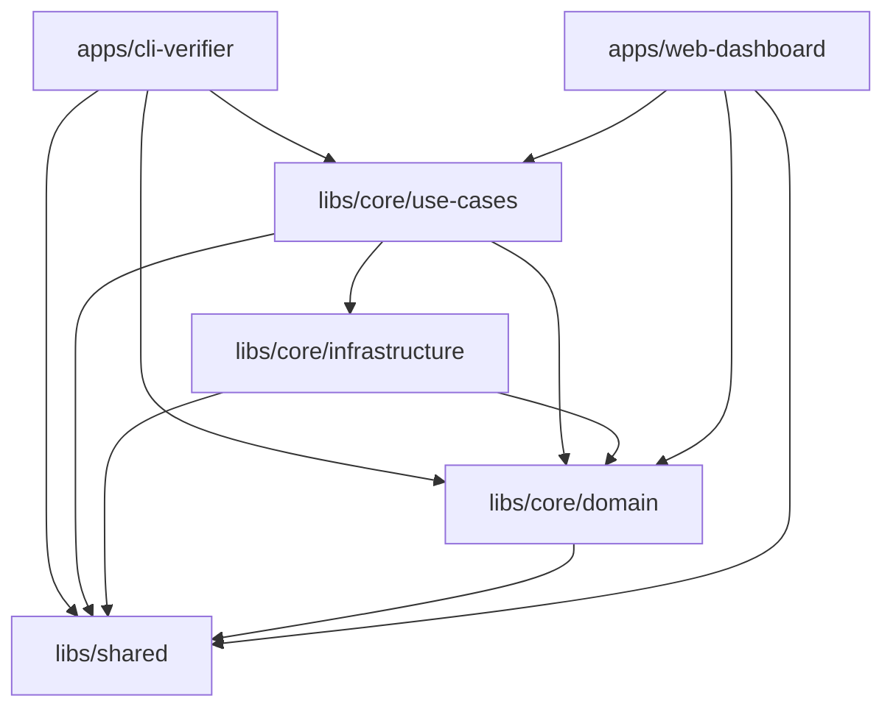

# 📚 Libraries

Shared libraries used across all mcp-verify applications.

---

## 🎯 Purpose

This directory contains reusable code organized into focused libraries following clean architecture principles. Each library has a specific responsibility and clear dependency rules.

---

## 📁 Structure

```
libs/
├── core/              # 🎯 Core business logic (NO external dependencies)
│   ├── domain/        #    Business models, rules, entities
│   ├── infrastructure/#    External adapters (logging, sandbox, etc.)
│   └── use-cases/     #    Application orchestration
│
├── shared/            # 🔧 Common utilities (used everywhere)
│   └── utils/         #    Helpers (i18n, paths, formatters)
│
├── protocol/          # 📡 MCP protocol definitions
│   └── types/         #    Protocol types, interfaces
│
└── transport/         # 🚀 Transport implementations
    ├── stdio/         #    STDIO transport
    ├── sse/           #    Server-Sent Events
    └── http/          #    HTTP transport
```

---

## 🏗️ Architecture Philosophy

### Clean Architecture Layers

```
┌─────────────────────────────────────────────┐
│          Apps (CLI, Dashboard, etc.)        │  ← User-facing applications
└─────────────────────────────────────────────┘
                    ↓ imports
┌─────────────────────────────────────────────┐
│            libs/core/use-cases/             │  ← Application orchestration
└─────────────────────────────────────────────┘
                    ↓ imports
┌─────────────────────────────────────────────┐
│            libs/core/domain/                │  ← Business logic (pure)
└─────────────────────────────────────────────┘
                    ↓ imports
┌─────────────────────────────────────────────┐
│            libs/shared/                     │  ← Utilities (used by all)
└─────────────────────────────────────────────┘
```

### Dependency Rules (CRITICAL)

| Library | Can Import From | CANNOT Import From |
|---------|-----------------|-------------------|
| **core/domain/** | `shared/` only | `core/infrastructure/`, `core/use-cases/`, `apps/`, external frameworks |
| **core/infrastructure/** | `core/domain/`, `shared/` | `core/use-cases/`, `apps/` |
| **core/use-cases/** | `core/domain/`, `core/infrastructure/`, `shared/` | `apps/` |
| **shared/** | Nothing (except Node.js built-ins) | `core/`, `apps/` |
| **apps/** | All `libs/` | Other `apps/` |

**Why?** This ensures:
- ✅ Domain logic is pure (testable, portable)
- ✅ Infrastructure is pluggable (swap implementations)
- ✅ Use cases are framework-agnostic
- ✅ Shared utilities are truly shared

---

## 📦 Library Descriptions

### `core/` - Core Business Logic

**Purpose**: Framework-agnostic business logic following hexagonal architecture.

**Contains**:
- Security rules (SQL injection, command injection, etc.)
- Validators (schema, protocol compliance)
- Report generators (HTML, SARIF, Markdown)
- Quality analyzers (LLM semantic analysis)

**Rules**:
- ❌ NO imports from frameworks (Express, Commander, etc.)
- ❌ NO I/O operations directly (use infrastructure/)
- ✅ Pure TypeScript functions and classes
- ✅ Fully unit-testable

**Read more**: [libs/core/README.md](./core/README.md)

---

### `shared/` - Common Utilities

**Purpose**: Utilities used across ALL applications and libraries.

**Contains**:
- i18n helper (`t()` function)
- Output formatters (CLI colors, tables)
- Error formatters
- Path validators (security checks)

**Rules**:
- ❌ NO business logic (keep it in core/)
- ❌ NO dependencies on other libs/
- ✅ Small, focused utilities
- ✅ Used by 2+ apps/libs

**Read more**: [libs/shared/README.md](./shared/README.md)

---

### `protocol/` - MCP Protocol Definitions

**Purpose**: Type definitions for Model Context Protocol.

**Contains**:
- JSON-RPC types
- MCP message types (tools, resources, prompts)
- Protocol constants

**Rules**:
- ❌ NO implementation logic (just types)
- ✅ Shared types for all transports
- ✅ Follows official MCP specification

---

### `transport/` - Transport Implementations

**Purpose**: Different ways to communicate with MCP servers.

**Contains**:
- STDIO transport (Node.js child processes)
- SSE transport (Server-Sent Events)
- HTTP transport (REST API)

**Rules**:
- ✅ Implements `ITransport` interface
- ✅ Protocol-agnostic (just sends/receives messages)
- ✅ Error handling + reconnection logic

**Related**: See `libs/core/domain/transport/` for interface

---

## 🛠️ Common Tasks

### Task 1: Add a New Security Rule

**Location**: `libs/core/domain/security/rules/`

**Steps**:
1. Create `libs/core/domain/security/rules/my-rule.ts`:
   ```typescript
   export class MyRule implements ISecurityRule {
     id = 'SEC-013';
     name = 'My Security Rule';
     severity = 'high';

     evaluate(discovery: DiscoveryResult): SecurityFinding[] {
       // Implementation
     }
   }
   ```

2. Register in `libs/core/domain/security/security-scanner.ts`

3. Add tests in `tests/core/domain/security/rules/my-rule.spec.ts`

**Details**: See [../CODE_MAP.md](../CODE_MAP.md#security-rules)

---

### Task 2: Add a New LLM Provider

**Location**: `libs/core/domain/quality/providers/`

**Steps**:
1. Create `libs/core/domain/quality/providers/my-provider.ts`:
   ```typescript
   export class MyProvider implements ILLMProvider {
     async complete(messages: LLMMessage[]): Promise<LLMResponse> {
       // Implementation
     }
   }
   ```

2. Register in `libs/core/domain/quality/llm-semantic-analyzer.ts`

3. Add tests in `tests/core/domain/quality/providers/my-provider.spec.ts`

**Details**: See [../CODE_MAP.md](../CODE_MAP.md#llm-providers)

---

### Task 3: Add a Shared Utility

**Location**: `libs/shared/utils/`

**When to add here**:
- ✅ Used by 2+ apps/libs
- ✅ No business logic
- ✅ Small, focused function

**When NOT to add here**:
- ❌ Only used in one app → Keep it in that app
- ❌ Contains business logic → Put in core/domain/
- ❌ Framework-specific → Put in infrastructure/

**Steps**:
1. Create `libs/shared/utils/my-util.ts`:
   ```typescript
   export function myUtil(input: string): string {
     // Implementation
   }
   ```

2. Export from `libs/shared/index.ts`

3. Import in your code:
   ```typescript
   import { myUtil } from '../../../shared/utils/my-util';
   ```

---

### Task 4: Add a New Transport

**Location**: `libs/core/domain/transport/`

**Steps**:
1. Create `libs/core/domain/transport/my-transport.ts`:
   ```typescript
   export class MyTransport implements ITransport {
     async initialize(): Promise<void> { /* ... */ }
     async sendRequest(method: string, params: any): Promise<any> { /* ... */ }
   }
   ```

2. Add to transport factory in `apps/cli-verifier/src/utils/transport-factory.ts`

3. Add tests in `tests/core/domain/transport/my-transport.spec.ts`

---

## 🔍 Finding the Right Place

**Decision Tree**:

```
Is it business logic?
├─ YES → core/domain/
└─ NO → Is it I/O or external service?
    ├─ YES → core/infrastructure/
    └─ NO → Is it application orchestration?
        ├─ YES → core/use-cases/
        └─ NO → Is it a utility used everywhere?
            ├─ YES → shared/
            └─ NO → Keep it in your app/
```

**Still unsure?** Check [../CODE_MAP.md](../CODE_MAP.md) for specific examples.

---

## 📊 Dependency Graph



**Key Insight**: `libs/shared/` has NO dependencies (most stable).
`libs/core/domain/` only depends on `shared/` (business logic is pure).

---

## ⚠️ Common Mistakes

### ❌ Mistake 1: Importing from apps/ in libs/

```typescript
// ❌ BAD: libs/core/domain/security/rule.ts
import { runValidationAction } from '../../../../apps/cli-verifier/src/commands/validate';
```

**Why?** Libraries should be reusable across apps. Importing from apps/ creates circular dependencies.

**Fix**: Extract shared logic to libs/, pass it as parameter, or use dependency injection.

---

### ❌ Mistake 2: Business Logic in shared/

```typescript
// ❌ BAD: libs/shared/utils/security-checker.ts
export function checkSQLInjection(tool: McpTool): SecurityFinding[] {
  // This is business logic, not a utility!
}
```

**Why?** `shared/` is for generic utilities, not business rules.

**Fix**: Move to `libs/core/domain/security/rules/`

---

### ❌ Mistake 3: Framework Dependencies in core/domain/

```typescript
// ❌ BAD: libs/core/domain/validator.ts
import express from 'express';

export class Validator {
  app = express(); // NO frameworks in domain!
}
```

**Why?** Domain should be framework-agnostic (testable, portable).

**Fix**: Move framework setup to `apps/` or `core/infrastructure/`

---

## 📚 Related Documentation

- [../CODE_MAP.md](../CODE_MAP.md) - "I want to add X" quick reference
- [ARCHITECTURE.md](../ARCHITECTURE.md) - System design philosophy
- [DEVELOPMENT.md](../DEVELOPMENT.md) - Local development setup
- [libs/core/README.md](./core/README.md) - Core library details
- [libs/shared/README.md](./shared/README.md) - Shared utilities catalog

---

## 🆘 Need Help?

**Can't find where something belongs?**

1. Check [../CODE_MAP.md](../CODE_MAP.md) - Searchable "I want to..." guide
2. Read [ARCHITECTURE.md](../ARCHITECTURE.md) - Understand design decisions
3. Ask in [GitHub Discussions](https://github.com/FinkTech/mcp-verify/discussions)

