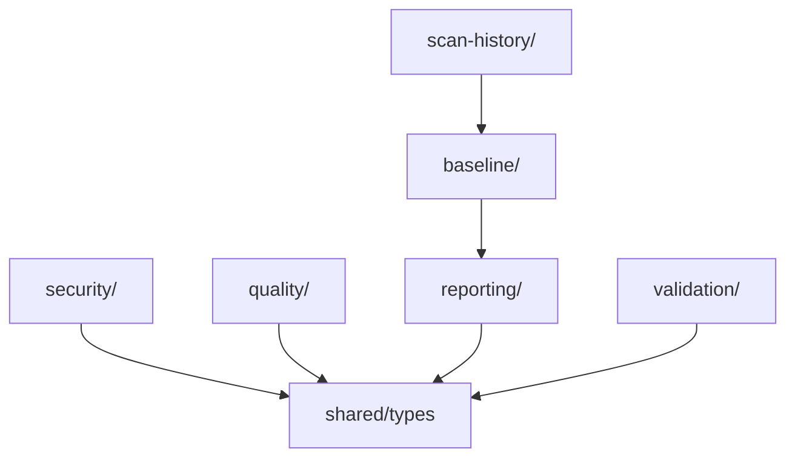

# 🎯 Domain Layer

Pure business logic for **mcp-verify** - framework-agnostic, no external dependencies, 100% testable.

---

## 📋 Purpose

The **domain layer** contains the **core business rules** of mcp-verify. This is the heart of the application where all security rules, validation logic, quality analysis, and reporting live.

### Key Principles

1. **Pure TypeScript**: No framework dependencies (Express, Commander, etc.)
2. **No I/O**: No file system, no network, no database (delegate to infrastructure)
3. **100% Testable**: Every class/function can be unit tested without mocks
4. **Framework-Agnostic**: Can be used in CLI, web, desktop, or API
5. **Business-Focused**: Only contains domain concepts (security, validation, quality)

---

## 📁 Structure

```
libs/core/domain/
├── security/                         # 🔒 Security analysis
│   ├── rules/                        # 12 OWASP security rules
│   │   ├── sql-injection.rule.ts    # SEC-001
│   │   ├── command-injection.rule.ts # SEC-002
│   │   ├── ssrf.rule.ts             # SEC-003
│   │   ├── data-leakage.rule.ts     # SEC-004
│   │   ├── path-traversal.rule.ts   # SEC-005
│   │   ├── xxe-injection.rule.ts    # SEC-006
│   │   ├── insecure-deserialization.rule.ts # SEC-007
│   │   ├── weak-crypto.rule.ts      # SEC-008
│   │   ├── auth-bypass.rule.ts      # SEC-009
│   │   ├── sensitive-exposure.rule.ts # SEC-010
│   │   ├── rate-limiting.rule.ts    # SEC-011
│   │   └── redos-detection.rule.ts  # SEC-012
│   ├── security-scanner.ts         # Security rule orchestrator
│   └── mcpignore-parser.ts          # .mcpignore file parser
│
├── quality/                          # ⭐ Quality analysis
│   ├── providers/                    # LLM provider implementations
│   │   ├── llm-provider.interface.ts # Provider contract
│   │   ├── anthropic-provider.ts    # Anthropic Claude
│   │   ├── ollama-provider.ts       # Ollama (local)
│   │   └── openai-provider.ts       # OpenAI GPT
│   ├── llm-semantic-analyzer.ts     # LLM analysis orchestrator
│   └── semantic-analyzer.ts         # Quality scoring logic
│
├── validation/                       # ✅ Protocol validation
│   └── protocol-validator.ts        # JSON-RPC 2.0 validation
│
├── validation-rules/                 # 📋 MCP validation rules
│   ├── protocol-layer/              # JSON-RPC compliance
│   ├── schema-layer/                # Schema validation
│   └── semantic-layer/              # Business logic validation
│
├── reporting/                        # 📊 Report generation
│   ├── html-generator.ts            # HTML reports
│   ├── markdown-generator.ts        # Markdown reports
│   ├── sarif-generator.ts           # SARIF reports (GitHub)
│   ├── badge-generator.ts           # Score badges
│   ├── graph-generator.ts           # Security graphs
│   ├── enhanced-reporter.ts         # Rich reporting
│   ├── hero-image.ts                # Report hero images
│   └── i18n.ts                      # Translations (361KB)
│
├── baseline/                         # 📈 Baseline comparison
│   └── baseline-manager.ts          # Compare reports over time
│
├── scan-history/                     # 🕒 Historical tracking
│   ├── scan-history-manager.ts      # Store scan results
│   ├── regression-detector.ts       # Detect regressions
│   └── types.ts                     # History types
│
├── performance/                      # ⚡ Performance testing
│   └── entities/
│       └── stress-result.types.ts   # Stress test results
│
├── config/                           # ⚙️ Configuration
│   ├── config-loader.ts             # Load config files
│   └── config.types.ts              # Config interfaces
│
├── mcp-server/                       # 🎯 MCP domain entities
│   ├── entities/                    # Domain models
│   ├── events/                      # Domain events
│   ├── repositories/                # Repository interfaces
│   └── services/                    # Domain services
│
├── sandbox/                          # 🔒 Sandbox interfaces
│   └── sandbox.interface.ts         # Sandbox contract
│
└── shared/                           # 🔧 Domain utilities
    └── types.ts                     # Shared domain types
```

---

## 🏗️ Domain Modules

### 1. Security Module (`security/`)

**Purpose**: Detect security vulnerabilities in MCP servers

**Responsibilities**:

- Analyze tool definitions for security risks
- Apply 12 OWASP rules
- Calculate security scores (0-100)
- Generate findings with severity levels

**Key Files**:

- `security-scanner.ts` - Main orchestrator
- `rules/*.rule.ts` - Individual security rules
- `mcpignore-parser.ts` - Exclusion rules

**Example**:

```typescript
import { SecurityScanner } from "./security/security-analyzer";

const scanner = new SecurityScanner();
const securityReport = await scanner.scan(discovery);
const findings = securityReport.findings;

// findings: [
//   { ruleCode: 'SEC-001', severity: 'critical', message: 'SQL injection risk...' }
// ]
```

---

### 2. Quality Module (`quality/`)

**Purpose**: Semantic analysis using LLMs

**Responsibilities**:

- Analyze tool quality (descriptions, schemas)
- Detect ambiguous descriptions
- Check schema completeness
- Support multiple LLM providers (Anthropic, Ollama, OpenAI)

**Key Files**:

- `llm-semantic-analyzer.ts` - LLM orchestrator
- `providers/*.ts` - Provider implementations
- `semantic-analyzer.ts` - Quality scoring

**Example**:

```typescript
import { LLMSemanticAnalyzer } from "./quality/llm-semantic-analyzer";

const analyzer = new LLMSemanticAnalyzer("anthropic:claude-haiku-4-5-20251001");
const issues = await analyzer.analyzeTools(tools);

// issues: [
//   { severity: 'medium', message: 'Tool description is too vague...' }
// ]
```

---

### 3. Validation Module (`validation/`)

**Purpose**: Protocol compliance checking

**Responsibilities**:

- Validate JSON-RPC 2.0 format
- Check MCP protocol version
- Verify message structure
- Detect protocol violations

**Key Files**:

- `protocol-validator.ts` - JSON-RPC validator

**Example**:

```typescript
import { ProtocolValidator } from "./validation/protocol-validator";

const validator = new ProtocolValidator();
const result = validator.validate(message);

// result: { valid: false, errors: ['Missing "jsonrpc" field'] }
```

---

### 4. Validation Rules Module (`validation-rules/`)

**Purpose**: Structured validation rules

**Layers**:

- **Protocol Layer**: JSON-RPC 2.0 compliance
- **Schema Layer**: JSON Schema validation
- **Semantic Layer**: Business rule validation

**Example**:

```typescript
import { ProtocolLayerRules } from "./validation-rules/protocol-layer";

const rules = new ProtocolLayerRules();
const violations = rules.check(tools);
```

---

### 5. Reporting Module (`reporting/`)

**Purpose**: Generate human-readable reports

**Responsibilities**:

- Generate HTML reports (with CSS, graphs)
- Generate Markdown reports
- Generate SARIF reports (GitHub Security)
- Generate badges (shields.io)
- Internationalization (i18n)

**Key Files**:

- `html-generator.ts` - Rich HTML reports
- `markdown-generator.ts` - CLI-friendly markdown
- `sarif-generator.ts` - GitHub integration
- `i18n.ts` - 2 languages (English, Spanish)

**Example**:

```typescript
import { HtmlReportGenerator } from "./reporting/html-generator";

const html = HtmlReportGenerator.generate(report, "en");
// Returns: <html>...</html> with embedded CSS
```

---

### 6. Baseline Module (`baseline/`)

**Purpose**: Compare reports over time (regression detection)

**Responsibilities**:

- Save baseline reports
- Compare current vs. baseline
- Detect score degradation
- Track new/fixed findings

**Key Files**:

- `baseline-manager.ts` - Comparison logic

**Example**:

```typescript
import { BaselineManager } from "./baseline/baseline-manager";

// Save baseline
BaselineManager.saveBaseline(report, "./baseline.json");

// Compare
const comparison = BaselineManager.compare(currentReport, baseline);
// comparison: { delta: { securityScore: -5, newCriticalFindings: 2 } }
```

---

### 7. Scan History Module (`scan-history/`)

**Purpose**: Track scans over time

**Responsibilities**:

- Store historical scan results
- Detect regressions
- Trend analysis

**Key Files**:

- `scan-history-manager.ts` - Storage
- `regression-detector.ts` - Regression logic

**Example**:

```typescript
import { ScanHistoryManager } from "./scan-history/scan-history-manager";

const history = new ScanHistoryManager();
history.addScan(report);

const regressions = history.detectRegressions();
```

---

### 8. Performance Module (`performance/`)

**Purpose**: Stress testing domain models

**Responsibilities**:

- Define stress test result types
- Performance metrics entities

**Key Files**:

- `entities/stress-result.types.ts` - Result types

---

### 9. Config Module (`config/`)

**Purpose**: Configuration loading and validation

**Responsibilities**:

- Load `.mcpverify.json` config
- Validate config structure
- Provide defaults

**Key Files**:

- `config-loader.ts` - Load and parse
- `config.types.ts` - TypeScript types

**Example**:

```typescript
import { ConfigLoader } from "./config/config-loader";

const config = ConfigLoader.load(".mcpverify.json");
// config: { security: { ignoreRules: ['SEC-001'] } }
```

---

### 10. MCP Server Module (`mcp-server/`)

**Purpose**: Domain entities for MCP servers

**Submodules**:

- `entities/` - Domain models (Tool, Resource, Prompt)
- `events/` - Domain events
- `repositories/` - Repository interfaces (no implementation)
- `services/` - Domain services

---

### 11. Sandbox Module (`sandbox/`)

**Purpose**: Sandbox interface definition

**Note**: Interface only, implementation in `infrastructure/`

**Key Files**:

- `sandbox.interface.ts` - Contract for sandboxes

---

## 🎯 What Belongs in Domain?

### ✅ YES - Domain Layer

**Business Rules**:

```typescript
// ✅ GOOD: Pure business logic
export class SqlInjectionRule implements ISecurityRule {
  readonly code = "SEC-003";
  readonly name = "SQL Injection";

  evaluate(discovery: DiscoveryResult): SecurityFinding[] {
    const findings: SecurityFinding[] = [];
    for (const tool of discovery.tools) {
      if (this.hasSqlPatterns(tool.inputSchema)) {
        findings.push({
          ruleCode: this.code,
          severity: "critical",
          message: "SQL injection risk detected",
          component: tool.name,
        });
      }
    }
    return findings;
  }

  private hasSqlPatterns(schema: any): boolean {
    // Pure logic, no I/O
    return /SELECT|INSERT|UPDATE|DELETE/.test(JSON.stringify(schema));
  }
}
```

**Calculations**:

```typescript
// ✅ GOOD: Pure calculation
export function calculateSecurityScore(findings: SecurityFinding[]): number {
  let score = 100;
  findings.forEach((finding) => {
    score -= finding.severity === "critical" ? 20 : 10;
  });
  return Math.max(0, score);
}
```

**Validation Logic**:

```typescript
// ✅ GOOD: Business rule validation
export class ProtocolValidator {
  validate(message: any): ValidationResult {
    if (!message.jsonrpc || message.jsonrpc !== "2.0") {
      return { valid: false, error: "Invalid JSON-RPC version" };
    }
    return { valid: true };
  }
}
```

---

### ❌ NO - Not Domain Layer

**File I/O**:

```typescript
// ❌ BAD: File system access
export class SecurityScanner {
  scan(toolsFile: string) {
    const content = fs.readFileSync(toolsFile); // NO! Use infrastructure
    return this.scanTools(JSON.parse(content));
  }
}

// ✅ GOOD: Delegate I/O to caller
export class SecurityScanner {
  scan(discovery: DiscoveryResult) {
    // Accept DiscoveryResult
    return this.scanInternal(discovery);
  }
}
```

**Network Calls**:

```typescript
// ❌ BAD: HTTP request in domain
export class LLMAnalyzer {
  async analyze(tool: McpTool) {
    const response = await fetch("https://api.anthropic.com/..."); // NO!
    return response.json();
  }
}

// ✅ GOOD: Use provider abstraction
export class LLMAnalyzer {
  constructor(private provider: ILLMProvider) {}

  async analyze(tool: McpTool) {
    return this.provider.complete([
      /* messages */
    ]); // Provider handles HTTP
  }
}
```

**Framework Dependencies**:

```typescript
// ❌ BAD: Express in domain
import express from 'express';

export class ReportServer {
  start() {
    const app = express();  // NO! Move to infrastructure
    app.get('/report', ...);
  }
}

// ✅ GOOD: Return data, let infrastructure serve it
export class ReportGenerator {
  generate(data: Report): string {
    return this.toHtml(data);  // Just return HTML string
  }
}
```

---

## 🔍 Decision Tree: Domain vs. Infrastructure

```
Does it contain business logic?
├─ YES → Is it pure (no I/O, no network, no framework)?
│   ├─ YES → ✅ Put in domain/
│   └─ NO → Is the I/O abstracted behind an interface?
│       ├─ YES → ✅ Put in domain/, implementation in infrastructure/
│       └─ NO → ❌ Refactor: separate pure logic from I/O
└─ NO → Does it interact with external systems?
    ├─ YES → ❌ Put in infrastructure/
    └─ NO → Is it a generic utility?
        ├─ YES → ❌ Put in shared/
        └─ NO → ❓ Reconsider if it's needed
```

---

## 🛠️ Common Tasks

### Task 1: Add a New Security Rule

See [libs/core/README.md - Task 1](../README.md#task-1-add-a-new-security-rule-30-minutes) for complete tutorial.

**Summary**:

1. Create `security/rules/my-rule.rule.ts`
2. Implement `ISecurityRule` interface
3. Register in `security-scanner.ts`
4. Add tests

---

### Task 2: Add Domain Entity

**Example**: Add `Prompt` entity

```typescript
// domain/mcp-server/entities/prompt.ts

export interface Prompt {
  name: string;
  description: string;
  arguments: PromptArgument[];
}

export interface PromptArgument {
  name: string;
  description: string;
  required: boolean;
}

export class PromptValidator {
  static validate(prompt: Prompt): ValidationResult {
    if (!prompt.name) {
      return { valid: false, error: "Prompt name is required" };
    }
    return { valid: true };
  }
}
```

---

### Task 3: Add Business Rule

**Example**: Validate tool name format

```typescript
// domain/validation/tool-name-validator.ts

export class ToolNameValidator {
  private static readonly VALID_PATTERN = /^[a-z][a-z0-9_]*$/;

  static validate(name: string): ValidationResult {
    if (!this.VALID_PATTERN.test(name)) {
      return {
        valid: false,
        error: "Tool name must be lowercase snake_case",
      };
    }
    return { valid: true };
  }
}
```

---

## 🧪 Testing Domain Layer

### Why Domain Testing is Easy

**No mocks needed** - Pure functions, deterministic output

```typescript
import { describe, it, expect } from "vitest";
import { SqlInjectionRule } from "./security/rules/sql-injection.rule";

describe("SqlInjectionRule", () => {
  it("should detect SQL injection patterns", () => {
    const rule = new SqlInjectionRule();
    const tool = {
      name: "execute_query",
      inputSchema: {
        properties: {
          query: { type: "string" }, // Dangerous!
        },
      },
    };

    const findings = rule.evaluate({
      tools: [
        {
          name: "execute_query",
          inputSchema: {
            properties: {
              query: { type: "string" }, // Dangerous!
            },
          },
        },
      ],
      resources: [],
      prompts: [],
    });

    expect(findings).toHaveLength(1);
    expect(findings[0].severity).toBe("critical");
  });
});
```

**No setup, no teardown** - Just call methods

---

## 📊 Domain Module Dependencies



**Key Insight**: All domain modules can depend on `shared/types`, but not on each other (loose coupling).

---

## 🚫 Anti-Patterns

### ❌ Anti-Pattern 1: I/O in Domain

```typescript
// ❌ BAD
export class ReportGenerator {
  generate(report: Report) {
    const html = this.toHtml(report);
    fs.writeFileSync("./report.html", html); // NO!
  }
}

// ✅ GOOD
export class ReportGenerator {
  generate(report: Report): string {
    return this.toHtml(report); // Return string, let caller write
  }
}
```

---

### ❌ Anti-Pattern 2: Framework Coupling

```typescript
// ❌ BAD
import { Request, Response } from "express";

export class SecurityScanner {
  analyze(req: Request, res: Response) {
    // Coupled to Express!
    const tools = req.body.tools;
    // ...
  }
}

// ✅ GOOD
export class SecurityScanner {
  scan(discovery: DiscoveryResult): SecurityFinding[] {
    // Pure domain types
    // ...
  }
}
```

---

### ❌ Anti-Pattern 3: Mixed Concerns

```typescript
// ❌ BAD
export class SecurityScanner {
  scan(discovery: DiscoveryResult) {
    const findings = this.findIssues(tools);

    // NO! Reporting is separate concern
    console.log("Security Analysis Report");
    console.log("======================");
    findings.forEach((f) => console.log(f.message));

    return findings;
  }
}

// ✅ GOOD
export class SecurityScanner {
  scan(discovery: DiscoveryResult): SecurityFinding[] {
    return this.findIssues(tools); // Just return data
  }
}
```

---

## 🔗 Related Documentation

- **[libs/core/README.md](../README.md)** - Core architecture overview
- **[libs/core/infrastructure/README.md](../infrastructure/README.md)** - Infrastructure adapters
- **[libs/core/use-cases/README.md](../use-cases/README.md)** - Use case orchestration
- **[CODE_MAP.md](../../../CODE_MAP.md)** - "I want to..." quick reference

---

## 💡 Tips & Best Practices

### Tip 1: Keep Domain Pure

**Test**: Can this class be instantiated without any setup?

```typescript
// ✅ GOOD: No dependencies
const scanner = new SecurityScanner();
const securityReport = await scanner.scan(discovery);
const findings = securityReport.findings;

// ❌ BAD: Needs database, config, etc.
const analyzer = new SecurityScanner(db, config, logger);
```

---

### Tip 2: Use Interfaces for External Dependencies

```typescript
// ✅ GOOD: Domain defines interface
export interface ILLMProvider {
  complete(messages: LLMMessage[]): Promise<LLMResponse>;
}

export class LLMAnalyzer {
  constructor(private provider: ILLMProvider) {}
  // Domain logic here
}
```

Implementation lives in `infrastructure/`:

```typescript
// infrastructure/llm/anthropic-provider.ts
export class AnthropicProvider implements ILLMProvider {
  async complete(messages: LLMMessage[]): Promise<LLMResponse> {
    // HTTP calls, SDK usage, etc.
  }
}
```

---

### Tip 3: Return Data, Not Side Effects

```typescript
// ✅ GOOD: Return data
export function generateReport(data: Report): string {
  return `<html>${data.score}</html>`;
}

// ❌ BAD: Side effect
export function generateReport(data: Report): void {
  fs.writeFileSync("report.html", `<html>${data.score}</html>`);
}
```
