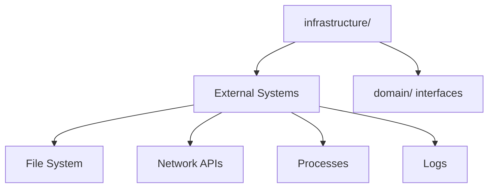

# 🔌 Infrastructure Layer

External adapters and implementations for **mcp-verify** - connects domain logic to the outside world.

---

## 📋 Purpose

The **infrastructure layer** contains **adapters** that connect pure domain logic to external systems. This layer handles all I/O operations, external services, and framework-specific code.

### Hexagonal Architecture

```
┌─────────────────────────────────────────┐
│         External Systems                │
│  (File System, Logs, APIs, Network)    │
└─────────────────┬───────────────────────┘
                  │
                  ↓
┌─────────────────────────────────────────┐
│      Infrastructure Layer (this)        │ ← Adapters
│  - Logging                              │
│  - File System                          │
│  - Config Management                    │
│  - Sandbox (Deno)                       │
│  - Error Handling                       │
│  - Monitoring                           │
└─────────────────┬───────────────────────┘
                  │
                  ↓
┌─────────────────────────────────────────┐
│         Domain Layer                    │ ← Pure business logic
│  (Security, Quality, Validation)       │
└─────────────────────────────────────────┘
```

**Key Principle**: **Dependency Inversion**
- Domain defines interfaces (ports)
- Infrastructure implements interfaces (adapters)
- Domain never imports from infrastructure

---

## 📁 Structure

```
libs/core/infrastructure/
├── logging/                          # 📝 Logging adapter
│   ├── logger.ts                     # Structured logger
│   └── __tests__/
│       └── logger.test.ts
│
├── sandbox/                          # 🔒 Execution sandbox
│   ├── deno-sandbox.ts               # Deno sandbox implementation
│   └── __tests__/
│       └── deno-sandbox.test.ts
│
├── config/                           # ⚙️ Configuration management
│   ├── config-manager.ts             # Read/write config files
│   └── __tests__/
│       └── config-manager.test.ts
│
├── diagnostics/                      # 🩺 System diagnostics
│   ├── diagnostic-runner.ts          # Run diagnostic checks
│   ├── diagnostic-check.interface.ts # Check contract
│   ├── checks/
│   │   └── environment-checks.ts     # Node, Deno, API keys
│   └── __tests__/
│       └── diagnostic-runner.test.ts
│
├── monitoring/                       # 📊 Health monitoring
│   ├── health-check.ts               # System health checks
│   └── __tests__/
│       └── health-check.test.ts
│
├── errors/                           # ❌ Error handling
│   ├── error-handler.ts              # Global error handler
│   └── __tests__/
│       └── error-handler.test.ts
│
└── index.ts                          # Public exports
```

---

## 🏗️ Infrastructure Modules

### 1. Logging (`logging/`)

**Purpose**: Structured logging to console/file

**Implements**: No interface (used directly)

**Responsibilities**:
- Log to console with levels (DEBUG, INFO, WARN, ERROR)
- Log to files (optional)
- Structured JSON logs
- Singleton pattern

**Usage**:
```typescript
import { Logger } from './infrastructure/logging/logger';

const logger = Logger.getInstance();

// Configure
logger.configure({
  level: 'INFO',              // 'DEBUG' | 'INFO' | 'WARN' | 'ERROR'
  enableConsole: true,
  enableFile: false,
  filePath: './logs/app.log'
});

// Log messages
logger.info('Starting validation', { target: 'http://localhost:3000' });
logger.warn('Slow response', { duration: 5000 });
logger.error('Connection failed', { error: err });
logger.debug('Raw response', { data: response });
```

**Features**:
- **Levels**: DEBUG < INFO < WARN < ERROR
- **Structured**: Logs include timestamp, level, message, metadata
- **Configurable**: Enable/disable console/file output
- **Singleton**: One logger instance app-wide

---

### 2. Sandbox (`sandbox/`)

**Purpose**: Execute untrusted code safely

**Implements**: `ISandbox` (defined in `domain/sandbox/`)

**Responsibilities**:
- Execute MCP servers in isolated environment
- Restrict file system access
- Restrict network access
- Prevent malicious code execution

**Current Implementation**: Deno Sandbox

**Usage**:
```typescript
import { DenoSandbox } from './infrastructure/sandbox/deno-sandbox';

const sandbox = new DenoSandbox({
  allowRead: ['.'],        // Allow reading current directory
  allowWrite: [],          // No write access
  allowEnv: true,          // Allow env variable access
  allowNet: [],            // No network access
  timeout: 10000           // 10 second timeout
});

// Execute command in sandbox
const result = await sandbox.execute('node', ['server.js']);
```

**Security Features**:
- **File System Isolation**: Restrict reads/writes to specific paths
- **Network Isolation**: Block all network or whitelist domains
- **Environment Access**: Control env variable visibility
- **Timeout Protection**: Kill long-running processes

---

### 3. Config Management (`config/`)

**Purpose**: Load and save configuration files

**Implements**: No interface (used directly)

**Responsibilities**:
- Read `.mcpverify.json` config files
- Write config files
- Validate config structure
- Provide defaults

**Usage**:
```typescript
import { ConfigManager } from './infrastructure/config/config-manager';

const manager = new ConfigManager();

// Load config
const config = await manager.load('./.mcpverify.json');
// config: {
//   security: { ignoreRules: ['SEC-001'] },
//   quality: { llmProvider: 'ollama:llama3.2' }
// }

// Save config
await manager.save('./.mcpverify.json', {
  security: { ignoreRules: ['SEC-001', 'SEC-002'] }
});

// Get with defaults
const config = await manager.loadOrDefault('./.mcpverify.json');
```

**Config File Format**:
```json
{
  "security": {
    "ignoreRules": ["SEC-001"],
    "ignorePaths": ["tests/**"]
  },
  "quality": {
    "llmProvider": "ollama:llama3.2"
  },
  "output": {
    "format": "html",
    "directory": "./reportes"
  }
}
```

---

### 4. Diagnostics (`diagnostics/`)

**Purpose**: System health diagnostics

**Implements**: Check pattern (interface + implementations)

**Responsibilities**:
- Check Node.js version
- Check Deno installation
- Check API keys (Anthropic, OpenAI)
- Check Ollama server
- Run all checks and report

**Usage**:
```typescript
import { DiagnosticRunner } from './infrastructure/diagnostics/diagnostic-runner';
import { EnvironmentChecks } from './infrastructure/diagnostics/checks/environment-checks';

const runner = new DiagnosticRunner();

// Add checks
runner.addCheck(new EnvironmentChecks());

// Run all checks
const results = await runner.runAll();

// results: [
//   { name: 'Node.js Version', status: 'pass', message: 'v18.17.0' },
//   { name: 'Deno Installed', status: 'pass', message: 'v1.40.0' },
//   { name: 'Anthropic API Key', status: 'fail', message: 'Not configured' },
//   { name: 'Ollama Server', status: 'pass', message: 'Running at http://localhost:11434' }
// ]
```

**Adding Custom Check**:
```typescript
import { IDiagnosticCheck, DiagnosticResult } from './diagnostic-check.interface';

export class MyCustomCheck implements IDiagnosticCheck {
  name = 'My Custom Check';

  async run(): Promise<DiagnosticResult> {
    try {
      // Check something
      const result = await checkSomething();

      return {
        name: this.name,
        status: result.ok ? 'pass' : 'fail',
        message: result.message
      };
    } catch (error) {
      return {
        name: this.name,
        status: 'error',
        message: error.message
      };
    }
  }
}
```

---

### 5. Monitoring (`monitoring/`)

**Purpose**: Application health monitoring

**Implements**: Health check pattern

**Responsibilities**:
- Monitor application health
- Check system resources
- Report uptime, memory usage

**Usage**:
```typescript
import { HealthCheck } from './infrastructure/monitoring/health-check';

const health = new HealthCheck();

const status = await health.check();
// status: {
//   status: 'healthy',
//   uptime: 3600,
//   memory: { used: 123456, total: 8589934592 },
//   checks: {
//     database: 'pass',
//     api: 'pass'
//   }
// }
```

---

### 6. Error Handling (`errors/`)

**Purpose**: Global error handling and formatting

**Implements**: No interface (utility)

**Responsibilities**:
- Catch unhandled errors
- Format errors for user display
- Log errors to logger

**Usage**:
```typescript
import { ErrorHandler } from './infrastructure/errors/error-handler';

const handler = new ErrorHandler(logger);

// Register global handlers
handler.registerGlobalHandlers();

// Handle specific error
try {
  await riskyOperation();
} catch (error) {
  handler.handle(error, { context: 'Validation' });
}
```

**Features**:
- **Uncaught Exception Handler**: Catches process-level errors
- **Unhandled Rejection Handler**: Catches promise rejections
- **Graceful Shutdown**: Cleanup before exit

---

## 🎯 Hexagonal Architecture Pattern

### Ports (Interfaces) - Defined in Domain

```typescript
// libs/core/domain/sandbox/sandbox.interface.ts

export interface ISandbox {
  execute(command: string, args: string[]): Promise<ExecutionResult>;
  cleanup(): Promise<void>;
}
```

### Adapters (Implementations) - Defined in Infrastructure

```typescript
// libs/core/infrastructure/sandbox/deno-sandbox.ts

export class DenoSandbox implements ISandbox {
  async execute(command: string, args: string[]): Promise<ExecutionResult> {
    // Implementation using Deno
    const process = Deno.run({ cmd: [command, ...args], ... });
    // ...
  }

  async cleanup(): Promise<void> {
    // Cleanup Deno processes
  }
}
```

### Usage in Domain

```typescript
// libs/core/use-cases/validator/validator.ts

export class MCPValidator {
  constructor(
    private transport: ITransport,
    private sandbox?: ISandbox  // ← Interface, not implementation
  ) {}

  async validate() {
    if (this.sandbox) {
      await this.sandbox.execute('node', ['server.js']);
    }
  }
}
```

**Benefits**:
- ✅ Domain doesn't know about Deno
- ✅ Can swap DenoSandbox for DockerSandbox without changing domain
- ✅ Easy to mock in tests

---

## 🔍 What Belongs in Infrastructure?

### ✅ YES - Infrastructure Layer

**File System Operations**:
```typescript
// ✅ GOOD: File I/O in infrastructure
export class ConfigManager {
  async load(path: string): Promise<Config> {
    const content = await fs.readFile(path, 'utf-8');
    return JSON.parse(content);
  }
}
```

**Network Operations**:
```typescript
// ✅ GOOD: HTTP in infrastructure
export class AnthropicProvider implements ILLMProvider {
  async complete(messages: LLMMessage[]): Promise<LLMResponse> {
    const response = await fetch('https://api.anthropic.com/...', {
      method: 'POST',
      headers: { 'x-api-key': this.apiKey },
      body: JSON.stringify({ messages })
    });
    return response.json();
  }
}
```

**External Services**:
```typescript
// ✅ GOOD: Deno integration in infrastructure
export class DenoSandbox implements ISandbox {
  async execute(command: string, args: string[]): Promise<ExecutionResult> {
    const process = Deno.run({ cmd: [command, ...args] });
    // ...
  }
}
```

---

### ❌ NO - Not Infrastructure Layer

**Business Logic**:
```typescript
// ❌ BAD: Business logic in infrastructure
export class ConfigManager {
  async load(path: string): Promise<Config> {
    const content = await fs.readFile(path, 'utf-8');
    const config = JSON.parse(content);

    // NO! This is business logic
    if (config.security.score < 50) {
      throw new Error('Security score too low');
    }

    return config;
  }
}

// ✅ GOOD: Just load config, let domain validate
export class ConfigManager {
  async load(path: string): Promise<Config> {
    const content = await fs.readFile(path, 'utf-8');
    return JSON.parse(content);  // Just parse, don't validate
  }
}
```

---

## 🛠️ Common Tasks

### Task 1: Add a New Diagnostic Check

**Time**: ~20 minutes
**Difficulty**: Beginner

**Steps**:

#### 1. Create Check Class

```typescript
// infrastructure/diagnostics/checks/my-check.ts

import { IDiagnosticCheck, DiagnosticResult } from '../diagnostic-check.interface';

export class MyCustomCheck implements IDiagnosticCheck {
  name = 'My Custom Check';
  description = 'Checks if something is configured correctly';

  async run(): Promise<DiagnosticResult> {
    try {
      // Perform check
      const isConfigured = await this.checkConfiguration();

      if (isConfigured) {
        return {
          name: this.name,
          status: 'pass',
          message: 'Configuration is valid'
        };
      } else {
        return {
          name: this.name,
          status: 'fail',
          message: 'Configuration not found',
          suggestion: 'Run: npm run setup'
        };
      }
    } catch (error) {
      return {
        name: this.name,
        status: 'error',
        message: error.message
      };
    }
  }

  private async checkConfiguration(): Promise<boolean> {
    // Implementation
    return true;
  }
}
```

#### 2. Register in Doctor Command

```typescript
// apps/cli-verifier/src/commands/doctor.ts

import { MyCustomCheck } from '../../../../libs/core/infrastructure/diagnostics/checks/my-check';

const runner = new DiagnosticRunner();
runner.addCheck(new EnvironmentChecks());
runner.addCheck(new MyCustomCheck());  // ← ADD HERE

const results = await runner.runAll();
```

#### 3. Test

```bash
mcp-verify doctor
```

---

### Task 2: Add a New Sandbox Implementation

**Time**: ~2 hours
**Difficulty**: Advanced

**Steps**:

#### 1. Implement ISandbox Interface

```typescript
// infrastructure/sandbox/docker-sandbox.ts

import { ISandbox, ExecutionResult } from '../../domain/sandbox/sandbox.interface';

export class DockerSandbox implements ISandbox {
  constructor(private options: DockerSandboxOptions) {}

  async execute(command: string, args: string[]): Promise<ExecutionResult> {
    // Run command in Docker container
    const dockerCommand = [
      'docker', 'run',
      '--rm',
      '--network', 'none',  // No network access
      '-v', `${process.cwd()}:/app`,  // Mount current dir
      'node:18-alpine',
      command,
      ...args
    ];

    const process = spawn(dockerCommand[0], dockerCommand.slice(1));

    return new Promise((resolve, reject) => {
      let stdout = '';
      let stderr = '';

      process.stdout.on('data', (data) => stdout += data);
      process.stderr.on('data', (data) => stderr += data);

      process.on('close', (code) => {
        resolve({
          exitCode: code,
          stdout,
          stderr,
          success: code === 0
        });
      });

      process.on('error', reject);
    });
  }

  async cleanup(): Promise<void> {
    // Cleanup Docker containers
  }
}
```

#### 2. Use in Validator

```typescript
// In CLI command or use-case
const sandbox = new DockerSandbox({
  allowNetwork: false,
  timeout: 30000
});

const validator = new MCPValidator(transport, sandbox);
```

---

## 🧪 Testing Infrastructure

### Why Infrastructure Testing is Different

**Requires external systems** - File system, network, processes

```typescript
import { describe, it, expect, beforeEach, afterEach } from 'vitest';
import { ConfigManager } from './config-manager';
import fs from 'fs/promises';

describe('ConfigManager', () => {
  const testConfigPath = './test-config.json';

  beforeEach(async () => {
    // Setup: Create test file
    await fs.writeFile(testConfigPath, JSON.stringify({ test: true }));
  });

  afterEach(async () => {
    // Teardown: Cleanup test file
    await fs.unlink(testConfigPath);
  });

  it('should load config from file', async () => {
    const manager = new ConfigManager();
    const config = await manager.load(testConfigPath);

    expect(config).toEqual({ test: true });
  });
});
```

**Integration tests** - Test real external systems

---

## 📊 Infrastructure Dependencies



**Key Insight**: Infrastructure depends on domain interfaces, not implementations.

---

## 🚫 Anti-Patterns

### ❌ Anti-Pattern 1: Business Logic in Infrastructure

```typescript
// ❌ BAD
export class ConfigManager {
  async load(path: string): Promise<Config> {
    const config = JSON.parse(await fs.readFile(path, 'utf-8'));

    // NO! This is business validation
    if (config.security.score < 50) {
      throw new Error('Security too low');
    }

    return config;
  }
}

// ✅ GOOD
export class ConfigManager {
  async load(path: string): Promise<Config> {
    return JSON.parse(await fs.readFile(path, 'utf-8'));
  }
}

// Validation in domain
export class ConfigValidator {
  validate(config: Config): ValidationResult {
    if (config.security.score < 50) {
      return { valid: false, error: 'Security too low' };
    }
    return { valid: true };
  }
}
```

---

### ❌ Anti-Pattern 2: Domain Importing Infrastructure

```typescript
// ❌ BAD: domain/security/analyzer.ts
import { Logger } from '../../infrastructure/logging/logger';  // NO!

export class SecurityAnalyzer {
  private logger = Logger.getInstance();

  analyze(tools: McpTool[]) {
    this.logger.info('Analyzing...');  // Domain coupled to infrastructure
    // ...
  }
}

// ✅ GOOD: Pass logger as dependency
export class SecurityAnalyzer {
  constructor(private logger?: ILogger) {}

  analyze(tools: McpTool[]) {
    this.logger?.info('Analyzing...');
    // ...
  }
}
```

---

## 🔗 Related Documentation

- **[libs/core/README.md](../README.md)** - Core architecture overview
- **[libs/core/domain/README.md](../domain/README.md)** - Domain layer (business logic)
- **[libs/core/use-cases/README.md](../use-cases/README.md)** - Use case orchestration
- **[CODE_MAP.md](../../../CODE_MAP.md)** - Codebase navigation

